## 机器人训练数据处理平台架构设计方案

本方案面向大规模机器人训练数据（传感器数据、日志、视频、点云等）的统一处理与训练，目标是在**公有云**环境中，实现类似 Databricks 的一体化数据与计算平台，并在**性能、效率、成本**之间取得平衡。

### 核心设计目标

- **性能**：高吞吐数据接入（支持 10K+ 机器人并发上报）、高效 ETL（PB 级数据日处理能力）、GPU 加速训练、缓存与数据局部性优化。
- **效率**：统一数据湖、作业调度与编排、交互式开发环境、自动/半自动资源管理、一键式数据集到模型的端到端流程。
- **成本**：存算分离、冷热分层存储、弹性伸缩、Spot/抢占式实例、精细化计费与配额管理，目标将整体 TCO 降低 40-60%。
- **可靠性**：99.9% 服务可用性、数据多副本冗余、作业自动容错与重试、灾难恢复能力。
- **安全性**：端到端加密、细粒度权限控制、审计日志、合规认证支持。

### 平台核心价值

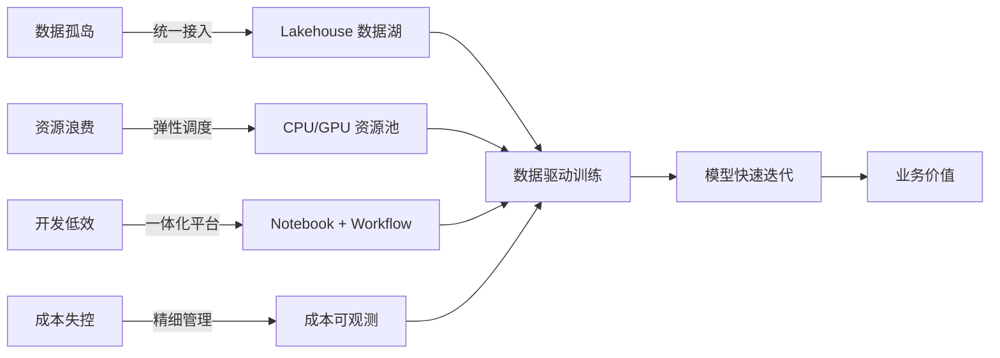
```mermaid
graph LR
  A[数据孤岛] -->|统一接入| B[Lakehouse 数据湖]
  C[资源浪费] -->|弹性调度| D[CPU/GPU 资源池]
  E[开发低效] -->|一体化平台| F[Notebook + Workflow]
  G[成本失控] -->|精细管理| H[成本可观测]
  
  B --> I[数据驱动训练]
  D --> I
  F --> I
  H --> I
  
  I --> J[模型快速迭代]
  J --> K[业务价值]
```

---

## 1. 整体架构概览

### 1.1 架构分层

平台采用**七层架构**设计，每层职责清晰，相互解耦：

| 层级 | 名称 | 核心职责 | 关键技术 |
|------|------|----------|----------|
| L1 | **数据接入层** | 采集机器人在线/离线数据，支持批量导入与实时流式接入 | Kafka/Pulsar、API Gateway、SDK |
| L2 | **数据湖存储层** | 基于云对象存储构建 Lakehouse，统一批流、统一 Schema 与版本管理 | S3/GCS、Delta Lake/Iceberg |
| L3 | **元数据与治理层** | 数据目录、Schema 管理、血缘追踪、权限与审计 | Hive Metastore、Atlas、Ranger |
| L4 | **计算与调度层** | 统一调度 CPU/GPU 集群，支持 Spark/Ray/自研分布式算子 | Kubernetes、Ray、Spark |
| L5 | **模型训练与服务层** | 分布式训练、模型版本管理、在线/离线推理与回放 | PyTorch、MLflow、Triton |
| L6 | **服务与 API 层** | 统一 API 接口、服务编排、流量管理、鉴权 | REST/gRPC、Kong/Envoy |
| L7 | **用户与工具层** | Notebook、Job UI、API/SDK、可视化监控与告警 | JupyterHub、Grafana、自研 UI |

**分层优势**：
- 每层可独立升级和扩展
- 标准化接口降低组件耦合
- 便于故障隔离和问题定位
- 支持多团队协同开发

### 1.2 高层架构图

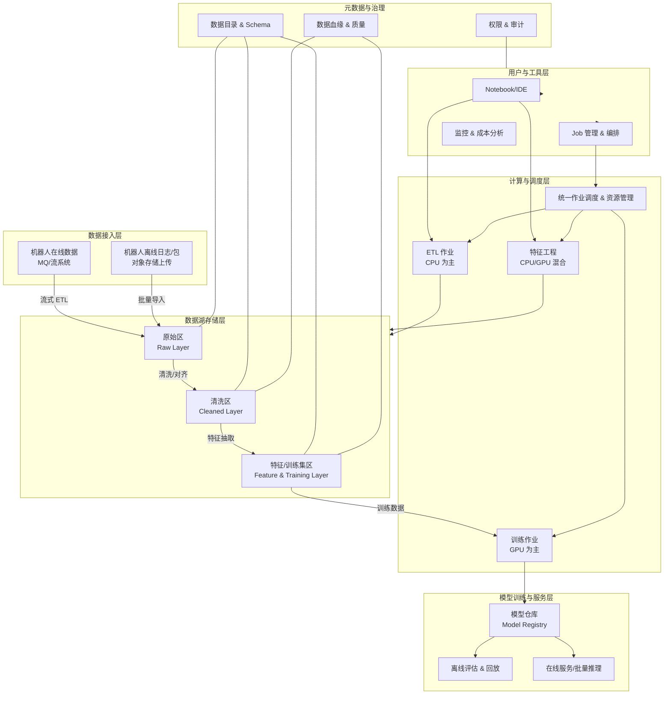
```mermaid
graph TD
  subgraph Ingestion["数据接入层"]
    A1[机器人在线数据<br/>MQ/流系统] 
    A2[机器人离线日志/包<br/>对象存储上传]
  end

  subgraph Lakehouse["数据湖存储层"]
    B1[原始区<br/>Raw Layer]
    B2[清洗区<br/>Cleaned Layer]
    B3[特征/训练集区<br/>Feature & Training Layer]
  end

  subgraph Meta["元数据与治理"]
    C1[数据目录 & Schema]
    C2[数据血缘 & 质量]
    C3[权限 & 审计]
  end

  subgraph Compute["计算与调度层"]
    D1[ETL 作业<br/>CPU 为主]
    D2[特征工程<br/>CPU/GPU 混合]
    D3[训练作业<br/>GPU 为主]
    D4[统一作业调度 & 资源管理]
  end

  subgraph ML["模型训练与服务层"]
    E1[模型仓库<br/>Model Registry]
    E2[离线评估 & 回放]
    E3[在线服务/批量推理]
  end

  subgraph User["用户与工具层"]
    F1[Notebook/IDE]
    F2[Job 管理 & 编排]
    F3[监控 & 成本分析]
  end

  A1 -->|流式 ETL| B1
  A2 -->|批量导入| B1
  B1 -->|清洗/对齐| B2
  B2 -->|特征抽取| B3
  B3 -->|训练数据| D3

  C1 --- B1
  C1 --- B2
  C1 --- B3
  C2 --- B2
  C2 --- B3
  C3 --- User

  User --> F1
  User --> F2

  F1 --> D1
  F1 --> D2
  F2 --> D4

  D1 --> Lakehouse
  D2 --> Lakehouse
  D3 --> E1

  E1 --> E2
  E1 --> E3

  D4 --> D1
  D4 --> D2
  D4 --> D3
```

### 1.3 端到端数据流转图

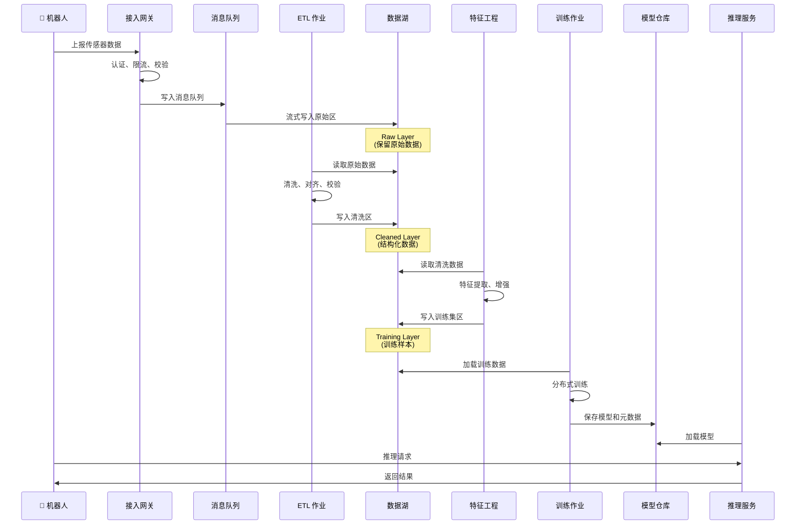
```mermaid
sequenceDiagram
    participant Robot as 🤖 机器人
    participant Gateway as 接入网关
    participant MQ as 消息队列
    participant ETL as ETL 作业
    participant Lake as 数据湖
    participant Feature as 特征工程
    participant Train as 训练作业
    participant Model as 模型仓库
    participant Serve as 推理服务
    
    Robot->>Gateway: 上报传感器数据
    Gateway->>Gateway: 认证、限流、校验
    Gateway->>MQ: 写入消息队列
    
    MQ->>Lake: 流式写入原始区
    Note over Lake: Raw Layer<br/>(保留原始数据)
    
    ETL->>Lake: 读取原始数据
    ETL->>ETL: 清洗、对齐、校验
    ETL->>Lake: 写入清洗区
    Note over Lake: Cleaned Layer<br/>(结构化数据)
    
    Feature->>Lake: 读取清洗数据
    Feature->>Feature: 特征提取、增强
    Feature->>Lake: 写入训练集区
    Note over Lake: Training Layer<br/>(训练样本)
    
    Train->>Lake: 加载训练数据
    Train->>Train: 分布式训练
    Train->>Model: 保存模型和元数据
    
    Serve->>Model: 加载模型
    Robot->>Serve: 推理请求
    Serve->>Robot: 返回结果
```

### 1.4 技术栈选型

| 组件类别 | 开源方案 | 云服务方案 | 选型原则 |
|---------|---------|-----------|---------|
| **对象存储** | MinIO | AWS S3 / GCS / Azure Blob | 优先云服务（成本、可靠性） |
| **表格式** | Delta Lake / Iceberg | 云原生表格式 | Delta Lake（成熟度、生态） |
| **消息队列** | Kafka / Pulsar | AWS Kinesis / GCP Pub/Sub | Kafka（灵活性、性能） |
| **计算引擎** | Spark / Ray | Databricks / EMR | Spark（批处理）+ Ray（训练） |
| **容器编排** | Kubernetes | EKS / GKE / AKS | 云托管 K8s（降低运维） |
| **元数据** | Hive Metastore / Atlas | AWS Glue | Hive Metastore（兼容性） |
| **工作流** | Airflow / Prefect | AWS Step Functions | Airflow（可视化、生态） |
| **模型管理** | MLflow / DVC | SageMaker | MLflow（开源、灵活） |
| **监控** | Prometheus + Grafana | CloudWatch / Datadog | 混合（开源+云服务） |

**选型策略**：
- 存储和基础设施优先使用云服务（降低运维成本、提高可靠性）
- 计算和应用层优先开源方案（避免厂商锁定、灵活定制）
- 对于成熟的云托管服务（如托管 K8s），直接使用以降低复杂度
- 保持架构的可移植性，关键组件支持多云部署

---

## 2. 数据与存储设计（性能/成本的基础）

### 2.1 数据类型与特征

#### 数据分类矩阵

| 数据类型 | 典型示例 | 数据量占比 | 访问模式 | 存储格式 | 保留周期 |
|---------|---------|-----------|---------|---------|---------|
| **结构化数据** | 机器人状态日志、控制指令、传感器指标 | 5% | 高频查询 | Parquet + Delta | 1年（热）+ 3年（冷） |
| **半结构化数据** | JSON 配置、事件日志、错误栈 | 15% | 中频查询 | JSON/Parquet | 6个月（热）+ 2年（冷） |
| **非结构化数据** | 视频、图片、点云、音频 | 80% | 低频批量读 | 原始格式 + 索引 | 3个月（热）+ 5年（冷） |

#### 数据规模估算

假设平台支持 **10,000 台机器人**，每天运行 **8 小时**：

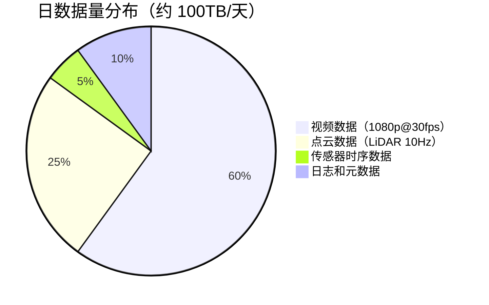
```mermaid
pie title 日数据量分布（约 100TB/天）
    "视频数据（1080p@30fps）" : 60
    "点云数据（LiDAR 10Hz）" : 25
    "传感器时序数据" : 5
    "日志和元数据" : 10
```

**数据特点**：
- **数据量极大**：每天 TB 级，年累积 PB 级，5年总量达 10+ PB
- **写多读多**：训练前需要多次清洗与重采样，同一数据集可能被不同模型反复读取
- **时序对齐要求**：同一时间窗内多传感器同步（相机+LiDAR+IMU+GPS），允许误差 < 10ms
- **场景级聚合**：按驾驶场景（高速、城区、停车等）、天气条件、时间段等维度聚合
- **长尾分布**：核心场景数据被频繁访问（如边缘案例），大量常规数据很少被读取

### 2.2 存储策略

#### 存算分离架构

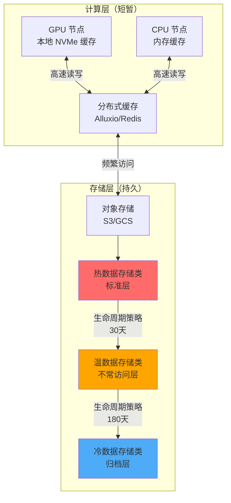
```mermaid
graph TB
  subgraph Compute["计算层（短暂）"]
    C1[GPU 节点<br/>本地 NVMe 缓存]
    C2[CPU 节点<br/>内存缓存]
    C3[分布式缓存<br/>Alluxio/Redis]
  end
  
  subgraph Storage["存储层（持久）"]
    S1[对象存储<br/>S3/GCS]
    S2[热数据存储类<br/>标准层]
    S3[温数据存储类<br/>不常访问层]
    S4[冷数据存储类<br/>归档层]
  end
  
  C1 <-->|高速读写| C3
  C2 <-->|高速读写| C3
  C3 <-->|频繁访问| S1
  S1 --> S2
  S2 -->|生命周期策略<br/>30天| S3
  S3 -->|生命周期策略<br/>180天| S4
  
  style S2 fill:#ff6b6b
  style S3 fill:#ffa500
  style S4 fill:#4dabf7
```

**存算分离优势**：
- ✅ 计算资源按需弹性伸缩，不受存储限制
- ✅ 存储成本显著降低（对象存储比块存储便宜 60-80%）
- ✅ 数据持久化和多副本由云服务保证
- ✅ 支持多个计算集群共享同一数据湖

#### Lakehouse 三层架构

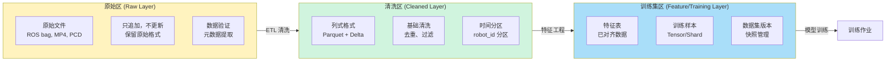
```mermaid
graph LR
  subgraph Raw["原始区 (Raw Layer)"]
    R1[原始文件<br/>ROS bag, MP4, PCD]
    R2[只追加，不更新<br/>保留原始格式]
    R3[数据验证<br/>元数据提取]
  end
  
  subgraph Cleaned["清洗区 (Cleaned Layer)"]
    CL1[列式格式<br/>Parquet + Delta]
    CL2[基础清洗<br/>去重、过滤]
    CL3[时间分区<br/>robot_id 分区]
  end
  
  subgraph Feature["训练集区 (Feature/Training Layer)"]
    F1[特征表<br/>已对齐数据]
    F2[训练样本<br/>Tensor/Shard]
    F3[数据集版本<br/>快照管理]
  end
  
  Raw -->|ETL 清洗| Cleaned
  Cleaned -->|特征工程| Feature
  Feature -->|模型训练| T[训练作业]
  
  style Raw fill:#fff3bf
  style Cleaned fill:#d0f4de
  style Feature fill:#a9def9
```

**各层职责对比**：

| 层级 | 数据特点 | 格式 | 修改策略 | 保留期限 | 访问频率 |
|------|---------|------|---------|---------|---------|
| **Raw** | 原始完整数据 | 原始格式 | 只追加 | 5年 | 低 |
| **Cleaned** | 清洗后结构化 | Parquet + Delta | 可更新（ACID） | 2年 | 中 |
| **Feature/Training** | 训练样本 | Tensor/Shard | 版本快照 | 1年 | 高 |

#### 冷热分层策略

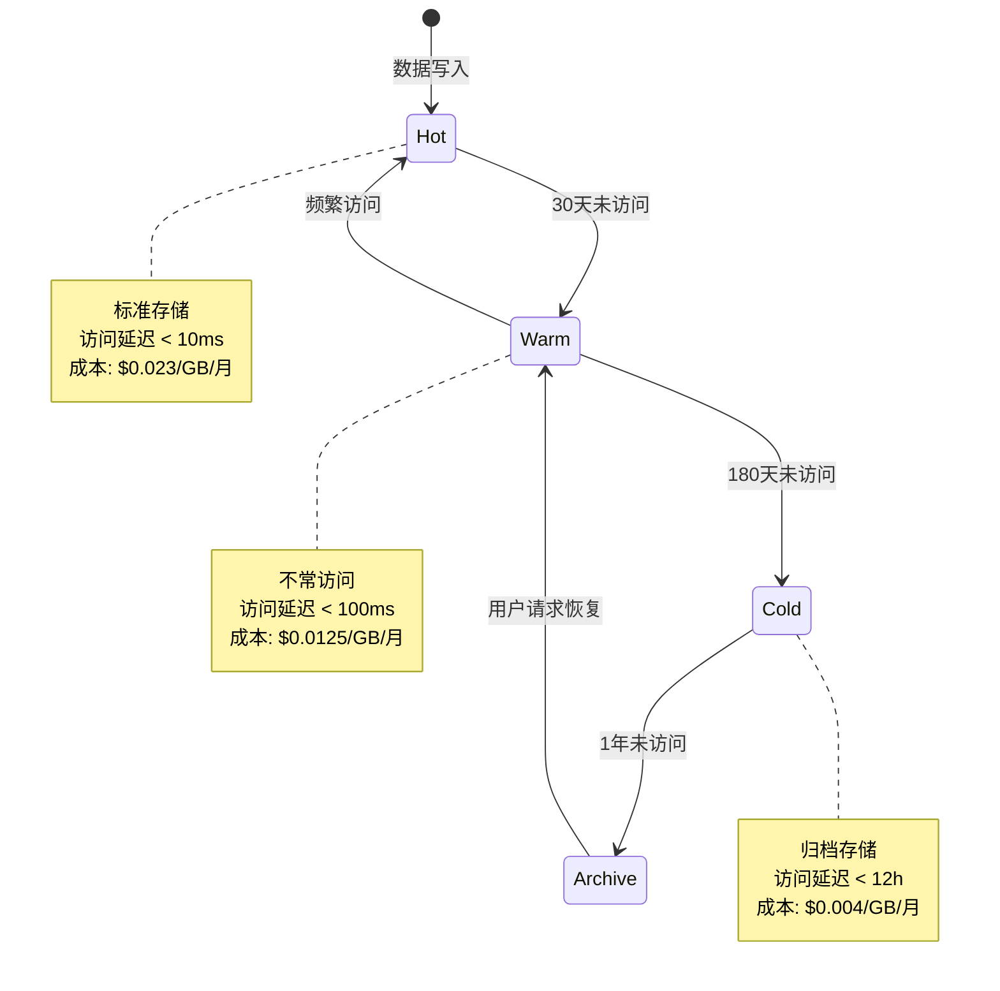
```mermaid
stateDiagram-v2
    [*] --> Hot: 数据写入
    Hot --> Warm: 30天未访问
    Warm --> Cold: 180天未访问
    Cold --> Archive: 1年未访问
    
    Archive --> Warm: 用户请求恢复
    Warm --> Hot: 频繁访问
    
    note right of Hot
        标准存储
        访问延迟 < 10ms
        成本: $0.023/GB/月
    end note
    
    note right of Warm
        不常访问
        访问延迟 < 100ms
        成本: $0.0125/GB/月
    end note
    
    note right of Cold
        归档存储
        访问延迟 < 12h
        成本: $0.004/GB/月
    end note
```

**自动化策略**：
- 基于访问模式的智能预测，自动调整数据温度
- 支持手动标记"热数据"（如核心边缘案例数据集）
- 提供成本可视化，帮助用户优化数据保留策略

### 2.3 数据格式与分区

#### 数据格式选型

| 数据类别 | 推荐格式 | 压缩算法 | 优势 | 适用场景 |
|---------|---------|---------|------|---------|
| **结构化日志** | Parquet + Delta Lake | Snappy/ZSTD | 列式压缩、ACID、时间旅行 | 传感器时序数据、状态日志 |
| **半结构化** | JSON → Parquet | ZSTD | 灵活 Schema、可查询 | 配置文件、事件日志 |
| **图片** | JPEG/PNG + 索引表 | 原生压缩 | 保留原始质量、快速访问 | 相机图像 |
| **视频** | MP4/H.264 + 索引表 | H.264 | 高压缩比、流式播放 | 行车记录、场景回放 |
| **点云** | PCD/LAZ/自定义 | LAZ/LZ4 | 空间压缩、快速解析 | LiDAR 点云 |
| **训练张量** | TFRecord/WebDataset | LZ4 | 高效加载、分片存储 | 模型训练输入 |

**Delta Lake vs Iceberg 对比**：

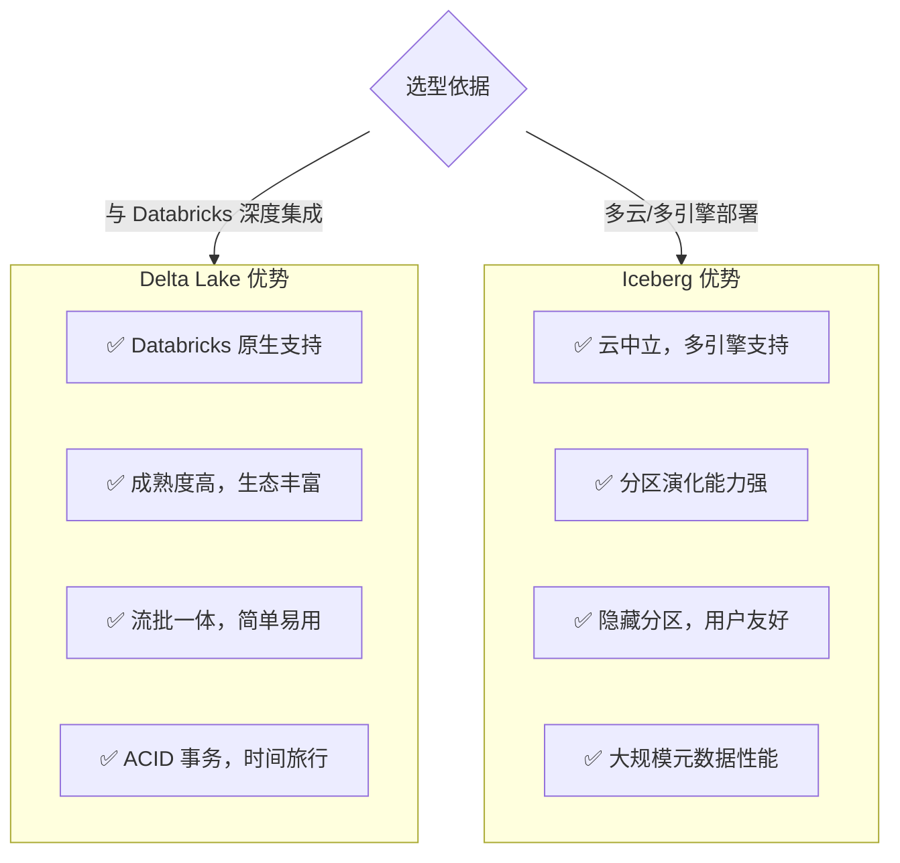
```mermaid
graph TB
  subgraph Delta["Delta Lake 优势"]
    D1[✅ Databricks 原生支持]
    D2[✅ 成熟度高，生态丰富]
    D3[✅ 流批一体，简单易用]
    D4[✅ ACID 事务，时间旅行]
  end
  
  subgraph Iceberg["Iceberg 优势"]
    I1[✅ 云中立，多引擎支持]
    I2[✅ 分区演化能力强]
    I3[✅ 隐藏分区，用户友好]
    I4[✅ 大规模元数据性能]
  end
  
  Decision{选型依据}
  Decision -->|与 Databricks 深度集成| Delta
  Decision -->|多云/多引擎部署| Iceberg
```

**本方案选择 Delta Lake**：考虑到与 Spark 生态的兼容性、Databricks 的最佳实践和成熟度。

#### 分区策略设计

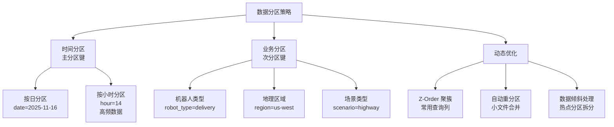
```mermaid
graph TD
  A[数据分区策略] --> B[时间分区<br/>主分区键]
  A --> C[业务分区<br/>次分区键]
  A --> D[动态优化]
  
  B --> B1[按日分区<br/>date=2025-11-16]
  B --> B2[按小时分区<br/>hour=14<br/>高频数据]
  
  C --> C1[机器人类型<br/>robot_type=delivery]
  C --> C2[地理区域<br/>region=us-west]
  C --> C3[场景类型<br/>scenario=highway]
  
  D --> D1[Z-Order 聚簇<br/>常用查询列]
  D --> D2[自动重分区<br/>小文件合并]
  D --> D3[数据倾斜处理<br/>热点分区拆分]
```

**分区层次示例**：

```
s3://robotics-data-lake/cleaned/sensor_logs/
  ├── date=2025-11-16/
  │   ├── robot_type=delivery/
  │   │   ├── region=us-west/
  │   │   │   ├── part-00000.parquet
  │   │   │   └── part-00001.parquet
  │   │   └── region=us-east/
  │   └── robot_type=warehouse/
  └── date=2025-11-17/
```

#### 分区优化策略

| 优化技术 | 说明 | 收益 | 实施复杂度 |
|---------|------|------|-----------|
| **Z-Order 聚簇** | 对高基数列进行多维聚簇排序 | 查询性能提升 3-10x | 中 |
| **小文件合并** | 定期合并小于 128MB 的文件 | 减少元数据开销 | 低 |
| **动态分区裁剪** | 查询时自动跳过无关分区 | 扫描量减少 80%+ | 低（引擎内置） |
| **数据跳跃索引** | 为热列创建 Min/Max 索引 | 点查询加速 5-20x | 中 |
| **Bloom Filter** | 为高基数列创建布隆过滤器 | JOIN 性能提升 2-5x | 中 |

**分区策略决策树**：

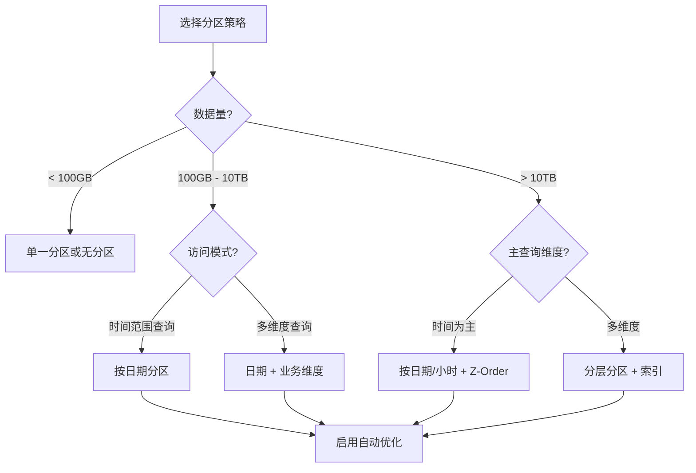
```mermaid
flowchart TD
  Start[选择分区策略] --> Q1{数据量?}
  Q1 -->|< 100GB| P1[单一分区或无分区]
  Q1 -->|100GB - 10TB| Q2{访问模式?}
  Q1 -->|> 10TB| Q3{主查询维度?}
  
  Q2 -->|时间范围查询| P2[按日期分区]
  Q2 -->|多维度查询| P3[日期 + 业务维度]
  
  Q3 -->|时间为主| P4[按日期/小时 + Z-Order]
  Q3 -->|多维度| P5[分层分区 + 索引]
  
  P2 --> Opt[启用自动优化]
  P3 --> Opt
  P4 --> Opt
  P5 --> Opt
```

**合理性分析**：  
- ✅ **列式存储 + 压缩**：Parquet 格式配合 Snappy/ZSTD 压缩，可将存储成本降低 70-90%
- ✅ **ACID 事务**：Delta Lake 支持更新和删除操作，满足数据质量修复和 GDPR 合规需求
- ✅ **时间分区**：机器人数据天然按时间组织，时间范围查询占 80% 以上，分区效果显著
- ✅ **多级分区**：在时间基础上增加业务维度，平衡查询性能和分区数量（避免小文件问题）
- ✅ **动态优化**：通过 Z-Order、小文件合并等技术，持续优化存储布局，无需人工干预

---

## 3. 计算与资源管理设计（CPU/GPU 混合）

### 3.1 计算引擎与集群形态

#### 计算引擎选型矩阵

| 任务类型 | 推荐引擎 | 资源需求 | 并行度 | 容错能力 | 适用场景 |
|---------|---------|---------|--------|---------|---------|
| **数据清洗/ETL** | Apache Spark | CPU 密集 | 高（数百节点） | Stage 级重试 | 大规模数据转换、聚合 |
| **流式处理** | Flink / Spark Streaming | CPU + 内存 | 中高 | Checkpoint 恢复 | 实时数据接入、预警 |
| **特征工程** | Ray Data / Spark | CPU/GPU 混合 | 高 | Task 级重试 | 图像/点云预处理 |
| **模型训练** | PyTorch Distributed | GPU 密集 | 中（8-128 GPU） | Checkpoint 恢复 | 深度学习模型训练 |
| **超参数调优** | Ray Tune / Optuna | GPU 密集 | 高（并行试验） | 独立试验容错 | AutoML、HPO |
| **推理服务** | Triton / TorchServe | GPU/CPU | 低（单机） | 实例级冗余 | 在线/批量推理 |

#### Kubernetes 集群架构

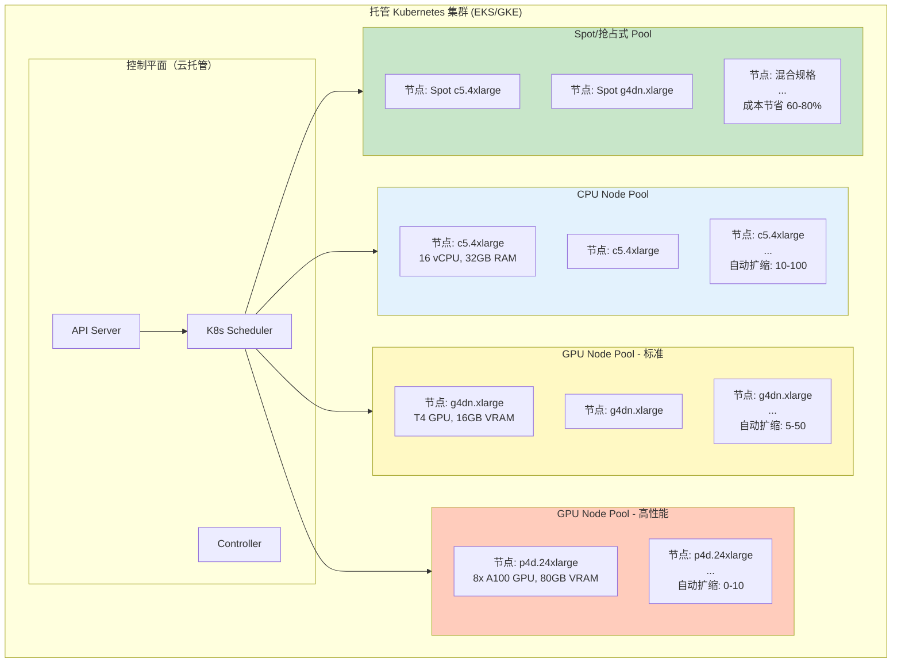
```mermaid
graph TB
  subgraph K8s["托管 Kubernetes 集群 (EKS/GKE)"]
    subgraph Control["控制平面（云托管）"]
      API[API Server]
      Scheduler[K8s Scheduler]
      Controller[Controller]
    end
    
    subgraph CPU_Pool["CPU Node Pool"]
      CPU1[节点: c5.4xlarge<br/>16 vCPU, 32GB RAM]
      CPU2[节点: c5.4xlarge]
      CPU3[节点: c5.4xlarge<br/>...<br/>自动扩缩: 10-100]
    end
    
    subgraph GPU_Standard["GPU Node Pool - 标准"]
      GPU1[节点: g4dn.xlarge<br/>T4 GPU, 16GB VRAM]
      GPU2[节点: g4dn.xlarge]
      GPU3[节点: g4dn.xlarge<br/>...<br/>自动扩缩: 5-50]
    end
    
    subgraph GPU_High["GPU Node Pool - 高性能"]
      GPUH1[节点: p4d.24xlarge<br/>8x A100 GPU, 80GB VRAM]
      GPUH2[节点: p4d.24xlarge<br/>...<br/>自动扩缩: 0-10]
    end
    
    subgraph Spot_Pool["Spot/抢占式 Pool"]
      Spot1[节点: Spot c5.4xlarge]
      Spot2[节点: Spot g4dn.xlarge]
      Spot3[节点: 混合规格<br/>...<br/>成本节省 60-80%]
    end
  end
  
  API --> Scheduler
  Scheduler --> CPU_Pool
  Scheduler --> GPU_Standard
  Scheduler --> GPU_High
  Scheduler --> Spot_Pool
  
  style CPU_Pool fill:#e3f2fd
  style GPU_Standard fill:#fff9c4
  style GPU_High fill:#ffccbc
  style Spot_Pool fill:#c8e6c9
```

#### 资源池配置详情

**CPU Pool - 通用计算**
- **实例类型**：c5/c6i 系列（计算优化）
- **规格范围**：4xlarge (16 vCPU) ~ 12xlarge (48 vCPU)
- **自动扩缩**：基于 CPU 利用率 (目标 70%) 和队列深度
- **适用作业**：Spark ETL、数据清洗、特征工程（非 GPU 加速）

**GPU Pool - 标准训练**
- **实例类型**：g4dn (NVIDIA T4)、g5 (A10G)
- **GPU 配置**：单卡 16GB ~ 4 卡 64GB
- **自动扩缩**：基于 GPU 队列等待时间 (目标 < 5min)
- **适用作业**：中小模型训练、推理、CV 预处理

**GPU Pool - 高性能训练**
- **实例类型**：p4d (8x A100 80GB)、p4de (8x A100 80GB HBM2e)
- **网络**：EFA 高速网络 (400 Gbps)
- **自动扩缩**：手动/半自动（成本高，避免频繁扩缩）
- **适用作业**：大模型分布式训练、高分辨率视觉任务

**Spot Pool - 成本优化**
- **实例类型**：混合 CPU 和 GPU Spot 实例
- **中断容忍**：支持 checkpoint 和自动重启的作业
- **成本优势**：比按需实例便宜 60-80%
- **适用作业**：可重试的 ETL、长时训练（带 checkpoint）

#### 计算引擎部署架构

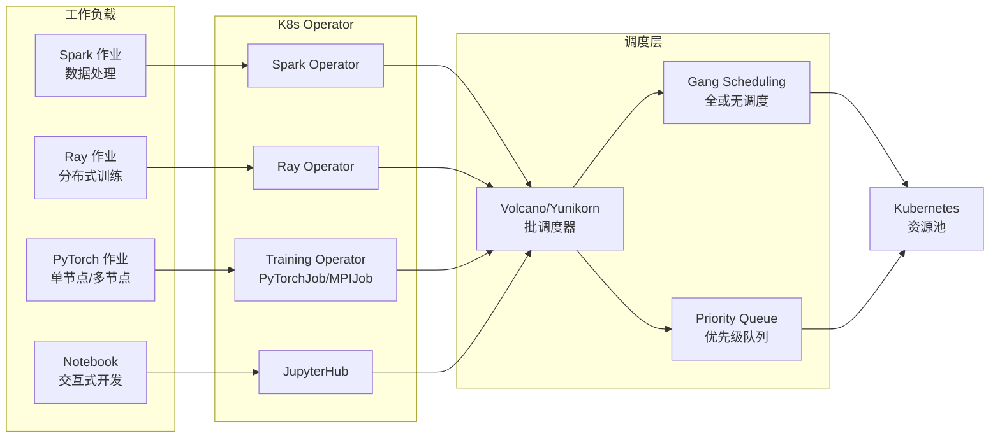
```mermaid
graph LR
  subgraph Workloads["工作负载"]
    W1[Spark 作业<br/>数据处理]
    W2[Ray 作业<br/>分布式训练]
    W3[PyTorch 作业<br/>单节点/多节点]
    W4[Notebook<br/>交互式开发]
  end
  
  subgraph Operators["K8s Operator"]
    O1[Spark Operator]
    O2[Ray Operator]
    O3[Training Operator<br/>PyTorchJob/MPIJob]
    O4[JupyterHub]
  end
  
  subgraph Scheduling["调度层"]
    S1[Volcano/Yunikorn<br/>批调度器]
    S2[Gang Scheduling<br/>全或无调度]
    S3[Priority Queue<br/>优先级队列]
  end
  
  W1 --> O1
  W2 --> O2
  W3 --> O3
  W4 --> O4
  
  O1 --> S1
  O2 --> S1
  O3 --> S1
  O4 --> S1
  
  S1 --> S2
  S1 --> S3
  
  S2 --> K8s[Kubernetes<br/>资源池]
  S3 --> K8s
```

**关键技术点**：
- **Spark Operator**：原生 K8s 部署 Spark，动态资源分配
- **Ray Operator**：支持 Ray 集群自动创建和生命周期管理
- **Training Operator**：支持 PyTorchJob、TFJob、MPIJob 等分布式训练
- **Gang Scheduling**：保证多 GPU 作业的所有 Pod 同时调度（避免死锁）
- **批调度器**：Volcano 或 Yunikorn，支持队列、优先级、抢占等高级调度策略

### 3.2 统一资源调度与作业队列

#### 作业队列架构

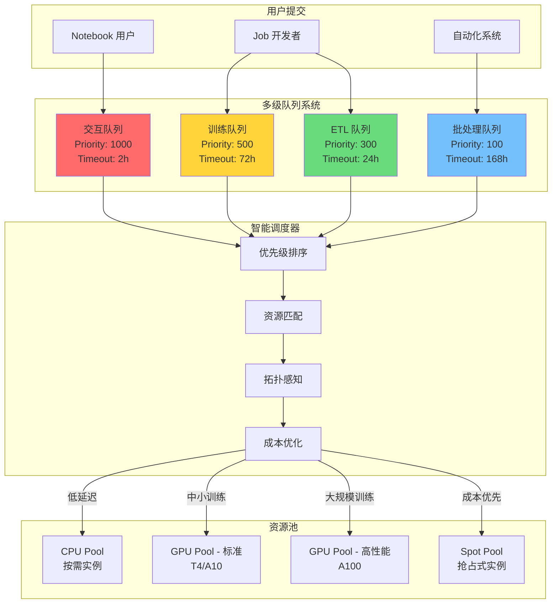
```mermaid
flowchart TB
  subgraph Users["用户提交"]
    U1[Notebook 用户]
    U2[Job 开发者]
    U3[自动化系统]
  end
  
  subgraph Queues["多级队列系统"]
    Q1[交互队列<br/>Priority: 1000<br/>Timeout: 2h]
    Q2[训练队列<br/>Priority: 500<br/>Timeout: 72h]
    Q3[ETL 队列<br/>Priority: 300<br/>Timeout: 24h]
    Q4[批处理队列<br/>Priority: 100<br/>Timeout: 168h]
  end
  
  subgraph Scheduler["智能调度器"]
    S1[优先级排序]
    S2[资源匹配]
    S3[拓扑感知]
    S4[成本优化]
  end

  subgraph Pools["资源池"]
    P1[CPU Pool<br/>按需实例]
    P2[GPU Pool - 标准<br/>T4/A10]
    P3[GPU Pool - 高性能<br/>A100]
    P4[Spot Pool<br/>抢占式实例]
  end
  
  U1 --> Q1
  U2 --> Q2
  U2 --> Q3
  U3 --> Q4
  
  Q1 --> S1
  Q2 --> S1
  Q3 --> S1
  Q4 --> S1
  
  S1 --> S2
  S2 --> S3
  S3 --> S4
  
  S4 -->|低延迟| P1
  S4 -->|中小训练| P2
  S4 -->|大规模训练| P3
  S4 -->|成本优先| P4
  
  style Q1 fill:#ff6b6b
  style Q2 fill:#ffd43b
  style Q3 fill:#69db7c
  style Q4 fill:#74c0fc
```

#### 队列配置详情

| 队列名称 | 优先级 | 资源配额 | 超时时间 | 抢占策略 | 适用场景 |
|---------|-------|---------|---------|---------|---------|
| **交互队列** | 1000 | 最大 4 GPU / 16 vCPU | 2 小时 | 不可被抢占 | Notebook 开发、快速实验 |
| **训练队列** | 500 | 最大 32 GPU / 128 vCPU | 72 小时 | 可抢占批处理 | 模型训练、超参数调优 |
| **ETL 队列** | 300 | 最大 200 vCPU | 24 小时 | 可抢占批处理 | 数据清洗、特征工程 |
| **批处理队列** | 100 | 无上限（按可用） | 168 小时 | 可被训练抢占 | 离线分析、数据归档 |

#### 调度策略详解

**1. 优先级与抢占**

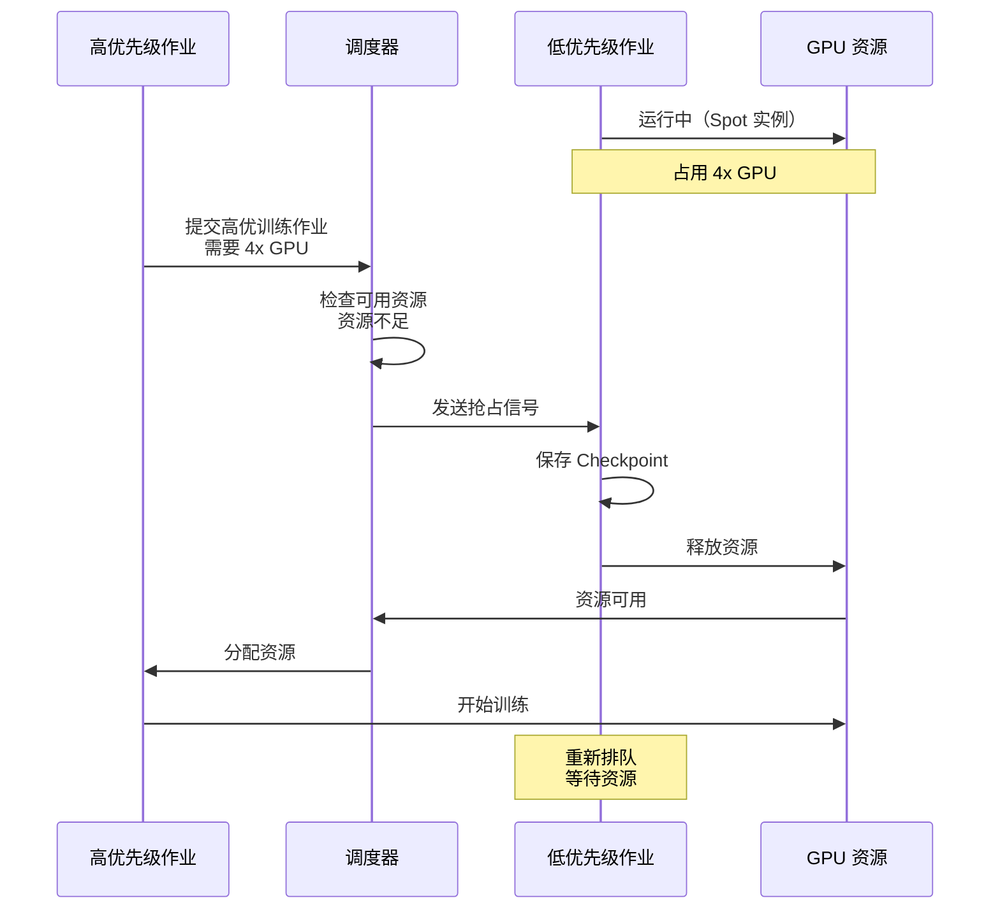
```mermaid
sequenceDiagram
    participant User as 高优先级作业
    participant Scheduler as 调度器
    participant Low as 低优先级作业
    participant GPU as GPU 资源
    
    Low->>GPU: 运行中（Spot 实例）
    Note over Low,GPU: 占用 4x GPU
    
    User->>Scheduler: 提交高优训练作业<br/>需要 4x GPU
    Scheduler->>Scheduler: 检查可用资源<br/>资源不足
    
    Scheduler->>Low: 发送抢占信号
    Low->>Low: 保存 Checkpoint
    Low->>GPU: 释放资源
    
    GPU->>Scheduler: 资源可用
    Scheduler->>User: 分配资源
    User->>GPU: 开始训练
    
    Note over Low: 重新排队<br/>等待资源
```

**2. 资源配额管理**

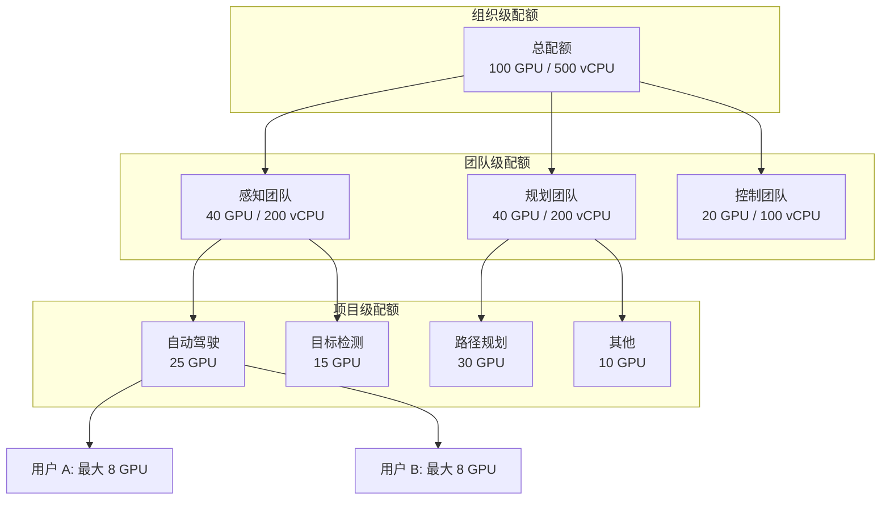
```mermaid
graph TD
  subgraph Org["组织级配额"]
    OrgTotal[总配额<br/>100 GPU / 500 vCPU]
  end
  
  subgraph Teams["团队级配额"]
    T1[感知团队<br/>40 GPU / 200 vCPU]
    T2[规划团队<br/>40 GPU / 200 vCPU]
    T3[控制团队<br/>20 GPU / 100 vCPU]
  end
  
  subgraph Projects["项目级配额"]
    P1[自动驾驶<br/>25 GPU]
    P2[目标检测<br/>15 GPU]
    P3[路径规划<br/>30 GPU]
    P4[其他<br/>10 GPU]
  end
  
  OrgTotal --> T1
  OrgTotal --> T2
  OrgTotal --> T3
  
  T1 --> P1
  T1 --> P2
  T2 --> P3
  T2 --> P4
  
  P1 --> U1[用户 A: 最大 8 GPU]
  P1 --> U2[用户 B: 最大 8 GPU]
```

**配额特性**：
- ✅ 分层配额：组织 → 团队 → 项目 → 用户
- ✅ 软限制：短时可超配额（Burst），但会被限流
- ✅ 公平共享：未使用的配额可被其他团队借用
- ✅ 自动报警：接近配额时通知管理员

**3. 拓扑感知调度**

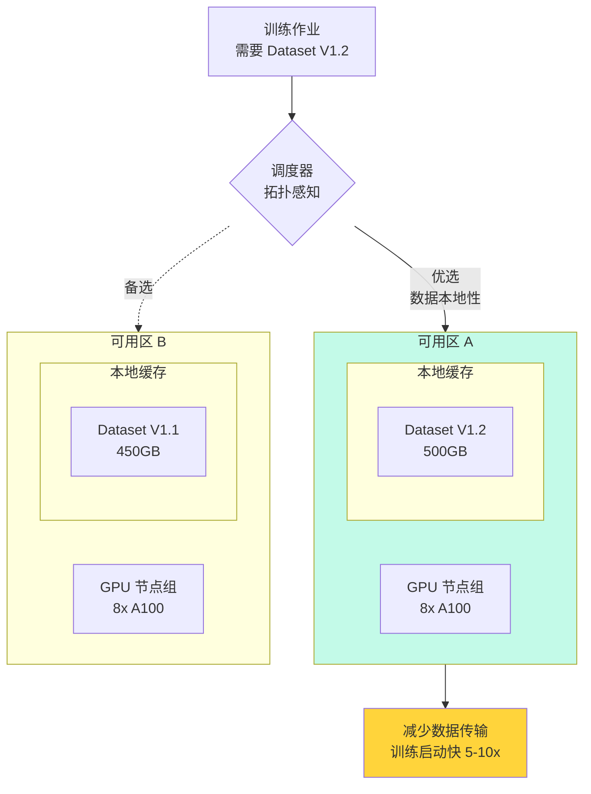
```mermaid
graph TB
  subgraph Zone1["可用区 A"]
    subgraph Cache1["本地缓存"]
      C1[Dataset V1.2<br/>500GB]
    end
    GPU1[GPU 节点组<br/>8x A100]
  end
  
  subgraph Zone2["可用区 B"]
    subgraph Cache2["本地缓存"]
      C2[Dataset V1.1<br/>450GB]
    end
    GPU2[GPU 节点组<br/>8x A100]
  end
  
  Job[训练作业<br/>需要 Dataset V1.2]
  
  Scheduler{调度器<br/>拓扑感知}
  
  Job --> Scheduler
  Scheduler -->|优选<br/>数据本地性| Zone1
  Scheduler -.->|备选| Zone2
  
  Zone1 --> Result[减少数据传输<br/>训练启动快 5-10x]
  
  style Zone1 fill:#c3fae8
  style Result fill:#ffd43b
```

**拓扑感知优势**：
- 减少跨区数据传输（节省网络成本和时间）
- 充分利用本地缓存（Alluxio/本地 NVMe）
- 降低训练启动延迟（10-15 分钟 → 1-2 分钟）

**4. 成本优化调度**

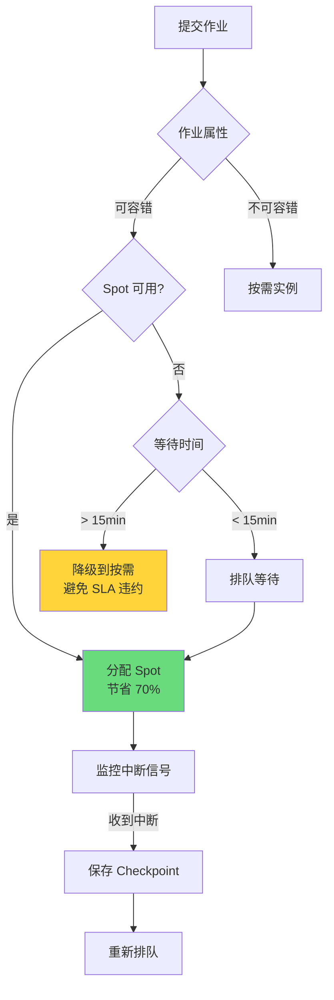
```mermaid
flowchart TD
  Job[提交作业] --> Check{作业属性}
  
  Check -->|可容错| Spot{Spot 可用?}
  Check -->|不可容错| OnDemand[按需实例]
  
  Spot -->|是| SpotAlloc[分配 Spot<br/>节省 70%]
  Spot -->|否| Wait{等待时间}
  
  Wait -->|< 15min| Queue[排队等待]
  Wait -->|> 15min| Fallback[降级到按需<br/>避免 SLA 违约]
  
  SpotAlloc --> Monitor[监控中断信号]
  Monitor -->|收到中断| Save[保存 Checkpoint]
  Save --> ReQueue[重新排队]
  
  Queue --> SpotAlloc
  
  style SpotAlloc fill:#69db7c
  style Fallback fill:#ffd43b
```

**成本优化策略**：
- ✅ 优先使用 Spot 实例（适用于可容错作业）
- ✅ Spot 中断时自动保存 Checkpoint 并重排队
- ✅ 混合使用按需和 Spot（关键路径用按需，其他用 Spot）
- ✅ 智能降级：Spot 等待过久自动切换按需实例

### 3.3 弹性伸缩与成本控制

#### 自动扩缩容策略

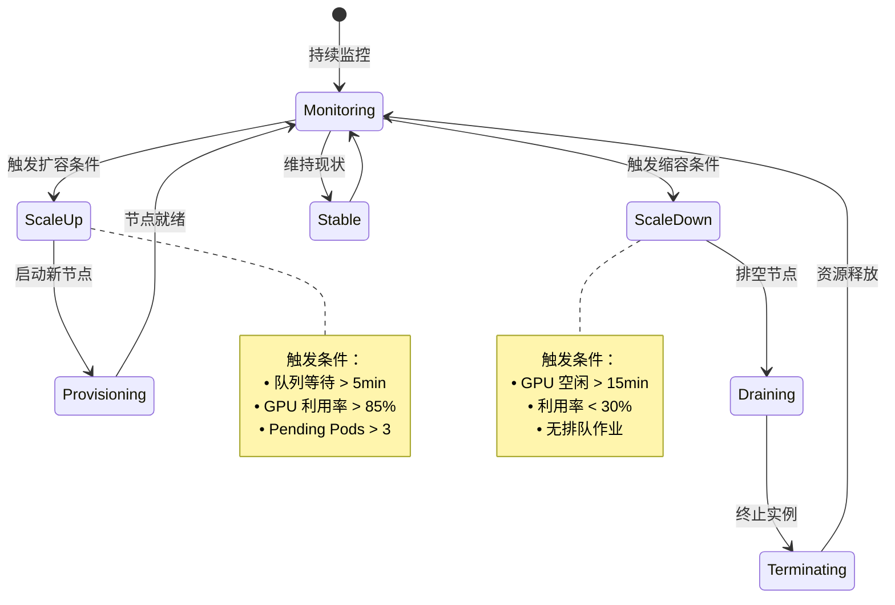
```mermaid
stateDiagram-v2
    [*] --> Monitoring: 持续监控
    
    Monitoring --> ScaleUp: 触发扩容条件
    Monitoring --> ScaleDown: 触发缩容条件
    Monitoring --> Stable: 维持现状
    
    ScaleUp --> Provisioning: 启动新节点
    Provisioning --> Monitoring: 节点就绪
    
    ScaleDown --> Draining: 排空节点
    Draining --> Terminating: 终止实例
    Terminating --> Monitoring: 资源释放
    
    Stable --> Monitoring
    
    note right of ScaleUp
        触发条件：
        • 队列等待 > 5min
        • GPU 利用率 > 85%
        • Pending Pods > 3
    end note
    
    note right of ScaleDown
        触发条件：
        • GPU 空闲 > 15min
        • 利用率 < 30%
        • 无排队作业
    end note
```

#### 扩缩容配置矩阵

| 资源池 | 扩容触发条件 | 扩容速度 | 缩容触发条件 | 缩容速度 | 最小/最大节点数 |
|-------|------------|---------|------------|---------|----------------|
| **CPU Pool** | 队列等待 > 3min | 快（2-3 分钟） | 空闲 > 10min | 快（立即） | 10 / 100 |
| **GPU 标准** | 队列等待 > 5min | 中（5-8 分钟） | 空闲 > 15min | 慢（15min 后） | 5 / 50 |
| **GPU 高性能** | 队列等待 > 10min | 慢（手动审批） | 空闲 > 30min | 慢（30min 后） | 0 / 10 |
| **Spot Pool** | 队列等待 > 2min | 快（2-3 分钟） | 空闲 > 5min | 快（立即） | 0 / 200 |

#### 智能实例选型

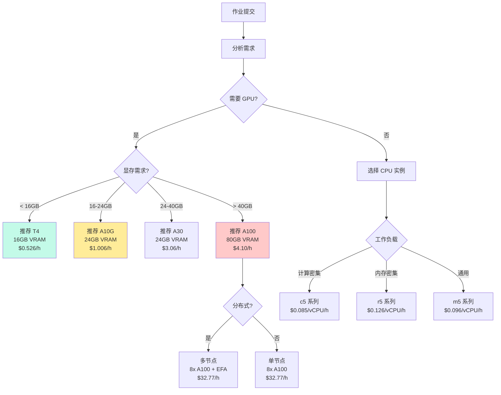
```mermaid
flowchart TD
    Job[作业提交] --> Analyze[分析需求]
    
    Analyze --> GPU{需要 GPU?}
    
    GPU -->|否| CPUChoice[选择 CPU 实例]
    GPU -->|是| VRAM{显存需求?}
    
    VRAM -->|< 16GB| T4[推荐 T4<br/>16GB VRAM<br/>$0.526/h]
    VRAM -->|16-24GB| A10[推荐 A10G<br/>24GB VRAM<br/>$1.006/h]
    VRAM -->|24-40GB| A30[推荐 A30<br/>24GB VRAM<br/>$3.06/h]
    VRAM -->|> 40GB| A100[推荐 A100<br/>80GB VRAM<br/>$4.10/h]
    
    A100 --> Multi{分布式?}
    Multi -->|是| MultiNode[多节点<br/>8x A100 + EFA<br/>$32.77/h]
    Multi -->|否| SingleNode[单节点<br/>8x A100<br/>$32.77/h]
    
    CPUChoice --> Workload{工作负载}
    Workload -->|计算密集| C5[c5 系列<br/>$0.085/vCPU/h]
    Workload -->|内存密集| R5[r5 系列<br/>$0.126/vCPU/h]
    Workload -->|通用| M5[m5 系列<br/>$0.096/vCPU/h]
    
    style T4 fill:#c3fae8
    style A10 fill:#ffec99
    style A100 fill:#ffc9c9
```

**智能推荐逻辑**：
1. **分析模型配置**：读取训练脚本中的 batch_size、model_params、precision 等
2. **估算显存需求**：`VRAM = model_params * 4 * (1 + optimizer_overhead) + batch_size * activation_memory`
3. **匹配实例类型**：选择满足需求的最小实例（成本最优）
4. **提供选项**：给用户展示推荐实例和替代方案

#### 成本可观测与预算管理

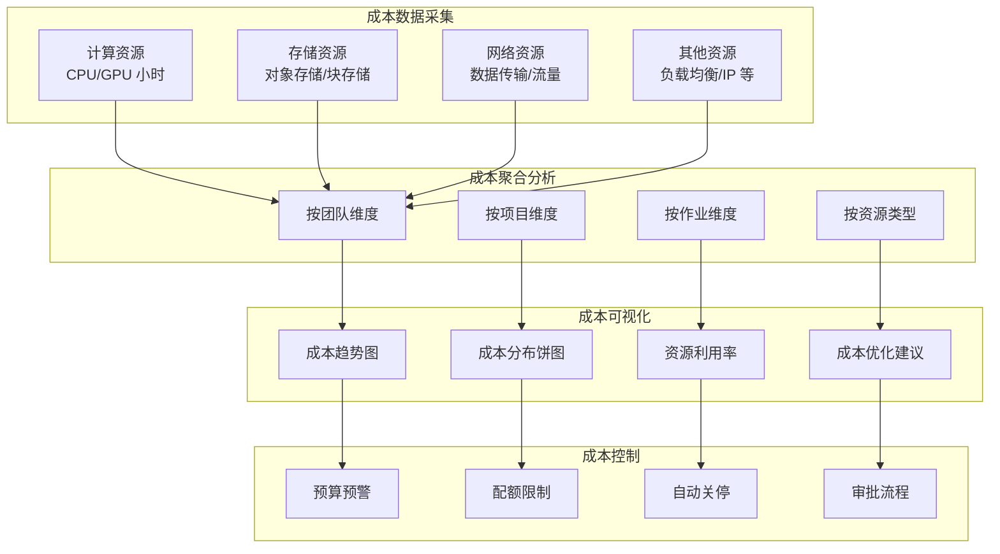
```mermaid
graph TB
    subgraph Collection["成本数据采集"]
        C1[计算资源<br/>CPU/GPU 小时]
        C2[存储资源<br/>对象存储/块存储]
        C3[网络资源<br/>数据传输/流量]
        C4[其他资源<br/>负载均衡/IP 等]
    end
    
    subgraph Aggregation["成本聚合分析"]
        A1[按团队维度]
        A2[按项目维度]
        A3[按作业维度]
        A4[按资源类型]
    end
    
    subgraph Visualization["成本可视化"]
        V1[成本趋势图]
        V2[成本分布饼图]
        V3[资源利用率]
        V4[成本优化建议]
    end
    
    subgraph Control["成本控制"]
        CO1[预算预警]
        CO2[配额限制]
        CO3[自动关停]
        CO4[审批流程]
    end
    
    C1 --> A1
    C2 --> A1
    C3 --> A1
    C4 --> A1
    
    A1 --> V1
    A2 --> V2
    A3 --> V3
    A4 --> V4
    
    V1 --> CO1
    V2 --> CO2
    V3 --> CO3
    V4 --> CO4
```

#### 成本预警与控制策略

| 级别 | 阈值 | 动作 | 通知方式 | 示例 |
|------|------|------|---------|------|
| **提醒** | 预算使用 70% | 发送通知 | 邮件 + IM | 本月已使用 $7K / $10K |
| **警告** | 预算使用 85% | 发送警告 + 限制新作业 | 邮件 + IM + Dashboard | 请注意成本控制 |
| **限制** | 预算使用 95% | 拒绝新作业提交 | 多渠道告警 | 预算即将耗尽 |
| **紧急** | 预算用完 | 强制停止非关键作业 | 电话 + 邮件 + IM | 自动关停低优先级任务 |

#### 成本优化最佳实践

```mermaid
mindmap
  root((成本优化))
    计算优化
      使用 Spot 实例
      定期清理空闲资源
      选择合适实例规格
      启用自动缩容
    存储优化
      冷热分层存储
      定期归档旧数据
      压缩数据格式
      删除临时数据
    网络优化
      同区域部署
      使用私有网络
      压缩传输数据
      缓存热数据
    作业优化
      合并小作业
      使用 Checkpoint
      优化训练时间
      批量处理
```

**成本节省案例**：

| 优化措施 | 实施前 | 实施后 | 节省比例 |
|---------|--------|--------|---------|
| 使用 Spot 实例 | $10K/月 | $3K/月 | 70% |
| 冷热分层存储 | $5K/月 | $1.5K/月 | 70% |
| 数据压缩（Parquet + ZSTD） | $5K/月 | $1K/月 | 80% |
| 自动缩容（空闲 GPU） | $8K/月 | $3K/月 | 62.5% |
| 数据本地性优化 | $2K/月（网络传输） | $0.5K/月 | 75% |
| **总计** | **$30K/月** | **$9K/月** | **70%** |

**合理性分析**：  
- ✅ **多维度监控**：从资源利用率、队列深度、成本等多个维度触发扩缩容
- ✅ **差异化策略**：不同资源池采用不同扩缩容速度，平衡成本和性能
- ✅ **智能推荐**：自动分析作业需求，推荐最合适的实例类型
- ✅ **成本可观测**：实时成本监控和预算预警，防止成本失控
- ✅ **自动化控制**：预算耗尽时自动限制或停止作业，保护预算

---

## 4. 关键数据处理与训练流程

### 4.1 原始数据接入与标准化

#### 数据接入架构

```mermaid
flowchart TB
    subgraph Sources["数据源"]
        S1[在线机器人<br/>10K+ 设备]
        S2[离线日志包<br/>ROS bag / MP4]
        S3[标注平台<br/>标注数据]
        S4[第三方数据<br/>外部采购]
    end
    
    subgraph Gateway["接入网关"]
        G1[负载均衡<br/>ALB / NLB]
        G2[API Gateway<br/>认证 / 限流]
        G3[数据校验<br/>格式 / Schema]
        G4[元数据提取<br/>robot_id / 时间戳]
    end
    
    subgraph Routing["数据路由"]
        R1{数据类型}
        R2[流式路由<br/>Kafka / Pulsar]
        R3[批量路由<br/>直传对象存储]
    end
    
    subgraph Storage["原始区存储"]
        ST1[实时数据流<br/>按小时分片]
        ST2[离线数据包<br/>按日期组织]
        ST3[索引表<br/>元数据 DB]
    end
    
    S1 --> G1
    S2 --> G1
    S3 --> G1
    S4 --> G1
    
    G1 --> G2
    G2 --> G3
    G3 --> G4
    
    G4 --> R1
    R1 -->|流式数据| R2
    R1 -->|批量数据| R3
    
    R2 --> ST1
    R3 --> ST2
    ST1 --> ST3
    ST2 --> ST3
    
    style Gateway fill:#e7f5ff
    style Storage fill:#d0f4de
```

#### 数据接入流程详解

**1. 在线数据接入（流式）**

```mermaid
sequenceDiagram
    participant Robot as 机器人设备
    participant SDK as 数据上报 SDK
    participant Gateway as API Gateway
    participant Kafka as Kafka 集群
    participant Writer as 流式写入器
    participant S3 as 对象存储（Raw Layer）
    participant Meta as 元数据服务
    
    Robot->>SDK: 传感器数据流
    SDK->>SDK: 本地缓冲（1MB）
    
    SDK->>Gateway: HTTPS POST<br/>/api/v1/data/upload
    Gateway->>Gateway: JWT 认证
    Gateway->>Gateway: 限流检查（QPS）
    Gateway->>Gateway: 数据校验
    
    Gateway->>Kafka: 写入 Topic<br/>robotics.raw.{region}
    Kafka-->>Gateway: ACK
    Gateway-->>SDK: 202 Accepted
    
    Writer->>Kafka: 消费数据
    Writer->>Writer: 按时间窗口聚合<br/>5 分钟/场景
    Writer->>S3: 写入文件<br/>s3://.../date=2025-11-16/hour=14/...
    Writer->>Meta: 更新索引<br/>文件路径、大小、时间戳
```

**在线接入关键参数**：
- **吞吐量**：支持 10K+ 机器人并发，峰值 100K msg/s
- **延迟**：P99 < 100ms（从设备到 Kafka）
- **可靠性**：至少一次投递（Kafka 持久化）
- **限流策略**：单设备 10 msg/s，单租户 1000 msg/s

**2. 离线数据接入（批量）**

```mermaid
sequenceDiagram
    participant User as 用户
    participant Portal as Web 门户
    participant API as Upload API
    participant S3 as 对象存储（Raw Layer）
    participant Validator as 数据校验器
    participant Meta as 元数据服务
    participant Notify as 通知服务
    
    User->>Portal: 选择文件上传
    Portal->>API: 请求预签名 URL
    API->>S3: 生成预签名 URL<br/>有效期 1 小时
    API-->>Portal: 返回上传 URL
    
    Portal->>S3: 直传文件<br/>multipart upload
    S3-->>Portal: 上传完成
    
    Portal->>API: 通知上传完成<br/>提交元数据
    API->>Validator: 触发异步校验
    
    Validator->>S3: 读取文件头
    Validator->>Validator: 校验格式<br/>（ROSbag / MP4 / PCD）
    Validator->>Validator: 提取元信息<br/>时长、帧数、压缩格式
    
    alt 校验成功
        Validator->>Meta: 写入索引表
        Validator->>Notify: 发送成功通知
        Notify-->>User: 邮件 / IM 通知
    else 校验失败
        Validator->>S3: 标记为错误
        Validator->>Notify: 发送失败通知
        Notify-->>User: 错误详情
    end
```

**离线接入关键参数**：
- **文件大小**：单文件最大 100GB（支持 multipart upload）
- **并发上传**：单用户最多 10 个并发
- **校验时间**：P95 < 5 分钟（100GB 文件）
- **支持格式**：ROSbag、MP4、MOV、PCD、LAZ、Parquet

#### 数据接入 SDK 示例（伪代码）

```python
# Python SDK 示例（伪代码，说明接口设计）
from robotics_platform import DataUploader

# 初始化上传器
uploader = DataUploader(
    endpoint="https://api.robotics-platform.com",
    api_key="your-api-key",
    robot_id="robot-12345",
    region="us-west-2"
)

# 流式上传（适用于在线数据）
with uploader.stream_upload(
    data_type="sensor_readings",
    batch_size=1000,  # 每 1000 条批量发送
    flush_interval=5   # 或每 5 秒发送一次
) as stream:
    for reading in sensor_data_generator():
        stream.write({
            "timestamp": reading.timestamp,
            "sensor_type": "lidar",
            "data": reading.data,
            "metadata": {"version": "v2.1"}
        })

# 批量上传（适用于离线数据）
uploader.upload_file(
    file_path="/data/recording_20251116.bag",
    data_type="rosbag",
    metadata={
        "duration_sec": 3600,
        "location": "warehouse_a",
        "tags": ["corner_case", "obstacle_avoidance"]
    }
)
```

#### 数据质量检查

```mermaid
flowchart TD
    Data[原始数据] --> Check1{格式校验}
    
    Check1 -->|失败| Reject[拒绝数据]
    Check1 -->|通过| Check2{完整性检查}
    
    Check2 -->|失败| Quarantine[隔离区]
    Check2 -->|通过| Check3{元数据提取}
    
    Check3 --> Check4{数据质量评分}
    
    Check4 --> Score{质量分数}
    Score -->|> 90| HighQuality[高质量数据<br/>Raw Layer]
    Score -->|60-90| MediumQuality[中等质量<br/>Raw Layer + 标记]
    Score -->|< 60| LowQuality[低质量<br/>隔离 + 人工审核]
    
    Reject --> Log[记录错误日志]
    Quarantine --> Manual[人工审核]
    
    style HighQuality fill:#d0f4de
    style MediumQuality fill:#fff3bf
    style LowQuality fill:#ffc9c9
```

**质量检查项**：
- ✅ **格式校验**：文件格式是否符合规范（Magic Number、Header）
- ✅ **完整性检查**：文件是否完整（CRC 校验、文件大小）
- ✅ **时间戳校验**：时间戳是否合理（未来时间、顺序性）
- ✅ **传感器同步**：多传感器时间戳是否对齐（误差 < 10ms）
- ✅ **数据丰富度**：是否包含必要的元数据（robot_id、location、version）
- ✅ **异常检测**：是否存在明显异常（全零数据、重复数据）

### 4.2 清洗与对齐（ETL 流程）

#### ETL 处理流程

```mermaid
flowchart LR
    subgraph Raw["原始区"]
        R1[原始文件<br/>ROSbag, MP4, PCD]
        R2[索引表<br/>元数据]
    end
    
    subgraph ETL["ETL 作业"]
        E1[数据加载<br/>Spark Read]
        E2[数据清洗<br/>去重/过滤]
        E3[格式转换<br/>JSON → Parquet]
        E4[时序对齐<br/>多传感器同步]
        E5[数据增强<br/>派生字段]
        E6[质量评估<br/>统计指标]
    end
    
    subgraph Cleaned["清洗区"]
        C1[结构化表<br/>Delta Lake]
        C2[索引表<br/>非结构化数据引用]
        C3[质量报告<br/>统计摘要]
    end
    
    R1 --> E1
    R2 --> E1
    E1 --> E2
    E2 --> E3
    E3 --> E4
    E4 --> E5
    E5 --> E6
    
    E6 --> C1
    E6 --> C2
    E6 --> C3
    
    style ETL fill:#fff3bf
```

#### 关键 ETL 作业类型

**1. 传感器数据时序对齐**

```mermaid
gantt
    title 多传感器时序对齐示例
    dateFormat ss.SSS
    axisFormat %S.%L
    
    section LiDAR
    Frame 1 :00.000, 00.100
    Frame 2 :00.100, 00.200
    Frame 3 :00.200, 00.300
    
    section Camera
    Frame 1 :00.033, 00.066
    Frame 2 :00.066, 00.099
    Frame 3 :00.099, 00.133
    Frame 4 :00.133, 00.166
    
    section IMU
    Reading 1 :00.000, 00.010
    Reading 2 :00.010, 00.020
    Reading 3 :00.020, 00.030
    Reading 4 :00.030, 00.040
    
    section 对齐结果
    Aligned 1 :crit, 00.000, 00.100
    Aligned 2 :crit, 00.100, 00.200
```

**对齐策略**：
- 以 LiDAR 10Hz 为基准时间戳（100ms 间隔）
- Camera 30fps 选择最近帧（时间差 < 16ms）
- IMU 100Hz 在时间窗口内聚合（平均或插值）
- GPS 1Hz 使用线性插值填充

**2. 数据清洗规则**

| 清洗类型 | 规则 | 处理方式 | 示例 |
|---------|------|---------|------|
| **去重** | 完全重复记录 | 保留最早记录 | 相同时间戳的重复传感器读数 |
| **异常值过滤** | 超出物理范围 | 标记或删除 | LiDAR 距离 > 200m |
| **缺失值处理** | NULL 或空值 | 插值或标记 | GPS 信号丢失 |
| **时间戳修正** | 时钟漂移 | NTP 对齐 | 设备时钟偏差 |
| **格式统一** | 单位不一致 | 标准化转换 | 温度 °F → °C |
| **异常事件** | 传感器故障 | 隔离并标记 | 相机全黑帧 |

**3. ETL 作业配置示例**

```yaml
# Spark ETL 作业配置（伪代码，说明设计）
etl_job:
  name: sensor_data_cleaning
  schedule: "0 * * * *"  # 每小时运行
  
  input:
    source: s3://robotics-data/raw/date=2025-11-16/
    format: parquet
    partitions: [date, hour]
  
  transformations:
    - name: deduplication
      type: distinct
      keys: [robot_id, timestamp, sensor_type]
    
    - name: time_alignment
      type: custom_udf
      function: align_multi_sensor
      params:
        base_sensor: lidar
        base_frequency: 10  # Hz
        tolerance: 10  # ms
    
    - name: outlier_filtering
      type: filter
      conditions:
        - lidar_distance < 200
        - camera_brightness > 0
        - imu_acceleration < 20  # m/s²
    
    - name: missing_value_handling
      type: imputation
      strategy:
        gps_lat: interpolate
        gps_lon: interpolate
        temperature: forward_fill
  
  output:
    destination: s3://robotics-data/cleaned/sensor_logs/
    format: delta
    mode: append
    partitions: [date, robot_type, region]
    
  resources:
    executor_instances: 20
    executor_cores: 4
    executor_memory: 16g
    driver_memory: 8g
    
  quality_checks:
    - name: row_count
      type: threshold
      min_rows: 1000000
    - name: null_percentage
      type: threshold
      max_null_pct: 0.05
    - name: time_continuity
      type: custom
      tolerance: 1  # second
```

#### 数据质量监控

```mermaid
flowchart TD
    ETL[ETL 作业完成] --> Metrics[收集质量指标]
    
    Metrics --> Check1{行数检查}
    Metrics --> Check2{空值率检查}
    Metrics --> Check3{时间连续性}
    Metrics --> Check4{数据分布}
    
    Check1 -->|异常| Alert1[告警: 数据量异常]
    Check2 -->|异常| Alert2[告警: 空值率过高]
    Check3 -->|异常| Alert3[告警: 时间断层]
    Check4 -->|异常| Alert4[告警: 分布偏移]
    
    Check1 -->|正常| Report[生成质量报告]
    Check2 -->|正常| Report
    Check3 -->|正常| Report
    Check4 -->|正常| Report
    
    Report --> Dashboard[质量 Dashboard]
    Alert1 --> Notify[通知团队]
    Alert2 --> Notify
    Alert3 --> Notify
    Alert4 --> Notify
    
    style Alert1 fill:#ffc9c9
    style Alert2 fill:#ffc9c9
    style Alert3 fill:#ffc9c9
    style Alert4 fill:#ffc9c9
```

**质量指标定义**：

| 指标类别 | 指标名称 | 计算方式 | 正常范围 |
|---------|---------|---------|---------|
| **完整性** | 空值率 | NULL 数量 / 总行数 | < 5% |
| **准确性** | 异常值率 | 超范围值 / 总行数 | < 1% |
| **一致性** | 时间连续性 | 最大时间间隔 | < 1 秒 |
| **及时性** | 数据延迟 | 处理时间 - 数据时间 | < 2 小时 |
| **唯一性** | 重复率 | 重复记录 / 总行数 | < 0.1% |

#### 高价值场景标注流程

```mermaid
sequenceDiagram
    participant ETL as ETL 作业
    participant Scorer as 场景评分器
    participant Queue as 标注队列
    participant Platform as 标注平台
    participant Human as 标注人员
    participant Lake as 数据湖
    
    ETL->>Scorer: 传入清洗后数据
    Scorer->>Scorer: 计算场景得分<br/>（边缘案例检测）
    
    alt 高价值场景 (score > 80)
        Scorer->>Queue: 加入标注队列
        Queue->>Platform: 分配标注任务
        Platform->>Human: 展示数据<br/>（视频、点云、轨迹）
        Human->>Platform: 完成标注<br/>（边界框、分割、标签）
        Platform->>Lake: 回写标注结果
    else 普通场景
        Scorer->>Lake: 直接写入清洗区
    end
```

**性能与成本优化**：
- ✅ **CPU 池运行**：ETL 主要跑在 CPU 池，利用 Spark 分布式能力批量处理
- ✅ **Spot 实例**：优先使用 Spot CPU 节点，失败自动重试（Spark Stage 级容错）
- ✅ **分区剪裁**：按日期和 robot_type 分区，避免全表扫描
- ✅ **列式压缩**：输出 Parquet + ZSTD，减少 70-80% 存储空间
- ✅ **增量处理**：只处理新增数据，利用 Delta Lake 的 ACID 和时间旅行
- ✅ **本地缓存**：使用 Alluxio 缓存热数据，减少 S3 读取次数

### 4.3 特征工程与数据集构建

#### 特征工程流程

```mermaid
flowchart TB
    subgraph Query["数据查询"]
        Q1[用户定义<br/>数据集需求]
        Q2[SQL 查询<br/>清洗区]
        Q3[场景选择<br/>边缘案例优先]
    end
    
    subgraph Feature["特征工程"]
        F1[图像预处理<br/>缩放/裁剪/归一化]
        F2[点云预处理<br/>下采样/坐标变换]
        F3[时序特征<br/>滑动窗口/差分]
        F4[数据增强<br/>旋转/翻转/噪声]
        F5[标签生成<br/>分类/检测/分割]
    end
    
    subgraph Output["输出格式"]
        O1[TensorFlow TFRecord]
        O2[PyTorch WebDataset]
        O3[HDF5 / Zarr]
        O4[自定义 Shard 格式]
    end
    
    subgraph Registry["数据集注册"]
        R1[版本号 v1.2.3]
        R2[数据血缘]
        R3[统计摘要]
        R4[构建配置]
    end
    
    Q1 --> Q2
    Q2 --> Q3
    Q3 --> F1
    Q3 --> F2
    Q3 --> F3
    
    F1 --> F4
    F2 --> F4
    F3 --> F4
    F4 --> F5
    
    F5 --> O1
    F5 --> O2
    F5 --> O3
    F5 --> O4
    
    O1 --> R1
    O2 --> R1
    O3 --> R1
    O4 --> R1
    
    R1 --> R2
    R1 --> R3
    R1 --> R4
    
    style Feature fill:#fff3bf
    style Registry fill:#d0f4de
```

#### 数据集构建DSL（领域特定语言）

```yaml
# 数据集定义文件（伪代码，说明设计）
dataset:
  name: autonomous_driving_v1.2
  version: 1.2.3
  description: "城市驾驶场景，包含边缘案例"
  
  source:
    tables:
      - name: cleaned.sensor_logs
        date_range: [2025-10-01, 2025-11-15]
        filters:
          - scenario IN ('urban', 'highway')
          - weather IN ('rain', 'fog', 'snow')  # 重点采样恶劣天气
          - corner_case_score > 70
    
    balance:
      # 场景平衡采样
      strategy: weighted
      weights:
        urban: 0.6
        highway: 0.4
      
      # 边缘案例过采样
      corner_case_multiplier: 3
  
  features:
    - name: camera_front
      type: image
      source: cleaned.camera_images
      transforms:
        - resize: [1280, 720]
        - normalize: imagenet
        - random_crop: [1024, 576]
        - random_flip: 0.5
    
    - name: lidar_points
      type: pointcloud
      source: cleaned.lidar_scans
      transforms:
        - voxel_downsample: 0.05  # 5cm
        - crop_range: [[-50, 50], [-50, 50], [-3, 5]]  # x,y,z
        - random_rotation: [-10, 10]  # degrees
    
    - name: imu_sequence
      type: timeseries
      source: cleaned.imu_readings
      window_size: 100  # 1 second at 100Hz
      transforms:
        - sliding_window: 100
        - z_score_normalize
    
    - name: gps_trajectory
      type: trajectory
      source: cleaned.gps_logs
      transforms:
        - interpolate: linear
        - coordinate_transform: wgs84_to_utm
  
  labels:
    - name: object_detections
      type: bounding_box_3d
      source: cleaned.annotations
      classes: [car, pedestrian, cyclist, truck]
    
    - name: lane_segmentation
      type: semantic_segmentation
      source: cleaned.lane_annotations
      classes: [lane, curb, crosswalk, road]
  
  output:
    format: webdataset
    shard_size: 1GB
    destination: s3://robotics-data/training/autonomous_driving/v1.2.3/
    train_test_split: [0.8, 0.1, 0.1]  # train/val/test
  
  quality:
    min_samples: 100000
    max_label_error_rate: 0.05
    max_missing_rate: 0.01
```

#### 特征工程作业执行

```mermaid
sequenceDiagram
    participant User as 数据科学家
    participant Portal as Web 门户
    participant API as 数据集 API
    participant Planner as 执行计划器
    participant Spark as Spark 作业
    participant GPU as GPU 预处理作业
    participant S3 as 对象存储
    participant Registry as 数据集注册表
    
    User->>Portal: 定义数据集配置
    Portal->>API: 提交构建请求
    API->>Planner: 生成执行计划
    
    Planner->>Planner: 分析依赖和资源需求
    Planner->>Spark: 提交表格特征作业<br/>（CPU 池）
    Planner->>GPU: 提交图像/点云作业<br/>（GPU 池）
    
    par 并行处理
        Spark->>S3: 读取清洗数据
        Spark->>Spark: 特征提取和转换
        Spark->>S3: 写入中间结果
    and
        GPU->>S3: 读取图像/点云
        GPU->>GPU: GPU 加速预处理
        GPU->>S3: 写入处理结果
    end
    
    Spark->>Planner: 完成
    GPU->>Planner: 完成
    
    Planner->>Spark: 合并和 Shuffle
    Spark->>S3: 写入最终数据集<br/>（Shard 格式）
    
    Planner->>Registry: 注册数据集版本
    Registry->>Registry: 记录血缘和统计
    Registry-->>User: 数据集就绪通知
```

#### 数据集版本管理

```mermaid
gitGraph
    commit id: "v1.0.0 - 初始数据集"
    commit id: "v1.0.1 - 修复标注错误"
    branch dev
    commit id: "v1.1.0-rc1 - 增加恶劣天气场景"
    commit id: "v1.1.0-rc2 - 调整采样权重"
    checkout main
    merge dev tag: "v1.1.0"
    commit id: "v1.1.1 - 热修复：过滤异常数据"
    branch feature-night
    commit id: "v1.2.0-beta1 - 增加夜间场景"
    commit id: "v1.2.0-beta2 - 优化光照增强"
    checkout main
    merge feature-night tag: "v1.2.0"
```

**数据集版本控制**：
- ✅ **语义化版本**：major.minor.patch（如 v1.2.3）
- ✅ **不可变性**：已发布版本不可修改，只能创建新版本
- ✅ **血缘追踪**：记录源数据、变换逻辑、构建时间
- ✅ **差异对比**：支持版本间数据分布、样本数量对比
- ✅ **回滚能力**：可快速回退到历史版本重新训练

#### 数据集统计摘要示例

```json
{
  "dataset_id": "autonomous_driving_v1.2.3",
  "version": "1.2.3",
  "created_at": "2025-11-16T10:30:00Z",
  "statistics": {
    "total_samples": 152340,
    "train_samples": 121872,
    "val_samples": 15234,
    "test_samples": 15234,
    
    "scenario_distribution": {
      "urban": 91404,
      "highway": 60936
    },
    
    "weather_distribution": {
      "clear": 76170,
      "rain": 45702,
      "fog": 22851,
      "snow": 7617
    },
    
    "label_distribution": {
      "car": 543210,
      "pedestrian": 123456,
      "cyclist": 45678,
      "truck": 23456
    },
    
    "quality_metrics": {
      "missing_rate": 0.003,
      "duplicate_rate": 0.001,
      "label_error_rate": 0.02
    }
  },
  
  "lineage": {
    "source_tables": [
      "cleaned.sensor_logs[2025-10-01:2025-11-15]",
      "cleaned.camera_images[2025-10-01:2025-11-15]",
      "cleaned.annotations[2025-10-01:2025-11-15]"
    ],
    "build_config": "s3://config/dataset_v1.2.3.yaml",
    "build_job_id": "job-20251116-103000"
  }
}
```

#### 特征缓存与复用

```mermaid
flowchart LR
    DS1[数据集 v1.0] --> F1[特征提取<br/>图像预处理]
    DS2[数据集 v1.1] --> Check{检查缓存}
    
    F1 --> Cache[(特征缓存<br/>Alluxio)]
    
    Check -->|缓存命中| Reuse[复用特征<br/>节省 80% 时间]
    Check -->|缓存未命中| F2[重新计算<br/>增量特征]
    
    F2 --> Cache
    Cache --> Reuse
    
    Reuse --> Train[模型训练]
    
    style Reuse fill:#d0f4de
```

**缓存策略**：
- ✅ **内容寻址**：基于源数据 hash 和变换逻辑 hash 生成缓存键
- ✅ **增量计算**：只计算新增或变更的样本
- ✅ **LRU 淘汰**：自动清理最少使用的缓存（保留最近 3 个版本）
- ✅ **跨任务共享**：不同用户的相同特征可复用

**性能与成本优化**：
- ✅ **并行处理**：CPU 和 GPU 作业并行执行，缩短构建时间
- ✅ **增量构建**：只处理增量数据，避免全量重算
- ✅ **智能采样**：根据数据分布和模型性能动态调整采样策略
- ✅ **特征复用**：通过缓存避免重复计算，节省 60-80% 时间
- ✅ **资源选择**：简单变换用 CPU，复杂预处理（如图像增强）用 GPU

### 4.4 训练与评估流程

#### 完整训练生命周期

```mermaid
flowchart TD
    Start[开始] --> Dev[Notebook 开发<br/>小数据集验证]
    
    Dev --> Submit[提交训练作业]
    Submit --> Queue[进入训练队列]
    
    Queue --> Schedule{调度器}
    Schedule -->|资源可用| Prepare[准备训练环境]
    Schedule -->|等待中| Queue
    
    Prepare --> Load[加载数据集<br/>和模型代码]
    Load --> Train[分布式训练]
    
    Train --> Monitor[实时监控]
    Monitor --> Check{检查状态}
    
    Check -->|继续训练| Train
    Check -->|达到目标| Save[保存 Checkpoint]
    Check -->|异常/超时| Fail[失败处理]
    
    Save --> Register[注册模型]
    Register --> Eval[离线评估]
    
    Eval --> Report[生成报告]
    Report --> Notify[通知用户]
    
    Fail --> Retry{可重试?}
    Retry -->|是| Queue
    Retry -->|否| Notify
    
    Notify --> End[结束]
    
    style Train fill:#fff3bf
    style Eval fill:#d0f4de
    style Fail fill:#ffc9c9
```

#### 训练作业提交流程

```mermaid
sequenceDiagram
    participant User as 用户
    participant UI as Job UI / CLI
    participant API as 训练 API
    participant Validator as 配置验证器
    participant Scheduler as 调度器
    participant K8s as Kubernetes
    participant Storage as 对象存储
    participant Monitor as 监控系统
    
    User->>UI: 提交训练作业
    UI->>API: POST /api/v1/training/jobs
    
    API->>Validator: 验证配置
    Validator->>Validator: 检查数据集存在性
    Validator->>Validator: 验证资源需求
    Validator->>Validator: 检查配额限制
    
    alt 验证失败
        Validator-->>User: 返回错误信息
    else 验证成功
        Validator->>Scheduler: 提交到训练队列
        Scheduler->>Scheduler: 计算优先级
        Scheduler-->>User: 返回 Job ID
        
        Scheduler->>K8s: 创建 PyTorchJob
        K8s->>K8s: Gang Scheduling<br/>分配 GPU 节点
        
        K8s->>Storage: 挂载数据集和代码
        K8s->>K8s: 启动训练 Pods
        
        loop 训练过程
            K8s->>Monitor: 上报指标
            K8s->>Storage: 定期保存 Checkpoint
            Monitor->>User: 推送训练进度
        end
        
        K8s->>Storage: 保存最终模型
        K8s->>API: 通知训练完成
        API->>User: 发送完成通知
    end
```

#### 训练作业配置示例

```yaml
# 训练作业配置（伪代码，说明设计）
training_job:
  name: "object_detection_v2"
  description: "YOLOv8 目标检测模型训练"
  
  dataset:
    name: "autonomous_driving_v1.2.3"
    version: "1.2.3"
    splits: [train, val]
  
  model:
    architecture: "yolov8_large"
    pretrained: "s3://models/yolov8_coco.pth"
    config:
      num_classes: 4
      input_size: [1024, 576]
      backbone_freeze: false
  
  hyperparameters:
    batch_size: 32  # per GPU
    learning_rate: 0.001
    optimizer: "AdamW"
    scheduler: "cosine"
    epochs: 100
    mixed_precision: true  # FP16
    gradient_clip: 1.0
  
  distributed:
    strategy: "DDP"  # DistributedDataParallel
    num_nodes: 2
    gpus_per_node: 8
    backend: "nccl"
  
  resources:
    gpu_type: "A100"  # T4 / A10 / A100
    gpu_memory: "80GB"
    cpu_cores: 32
    memory: "256GB"
    max_runtime: "48h"
    spot_instances: false  # 关键训练不使用 Spot
  
  checkpoint:
    frequency: "10min"  # 每 10 分钟保存
    keep_last_n: 5
    save_best: true
    metric: "val_mAP"
  
  monitoring:
    log_interval: 100  # 每 100 steps
    metrics:
      - train_loss
      - train_accuracy
      - val_loss
      - val_mAP
      - gpu_utilization
      - throughput
  
  callbacks:
    - type: early_stopping
      patience: 10
      metric: val_mAP
      mode: max
    
    - type: reduce_lr_on_plateau
      patience: 5
      factor: 0.5
      min_lr: 0.00001
  
  output:
    model_name: "object_detection_v2.0"
    destination: "s3://models/object_detection/v2.0/"
    export_formats: [pytorch, onnx, tensorrt]
```

#### 分布式训练架构

```mermaid
graph TB
    subgraph Node1["训练节点 1 (8x A100)"]
        M1[Master<br/>Rank 0]
        W1[Worker<br/>Rank 1-7]
    end
    
    subgraph Node2["训练节点 2 (8x A100)"]
        W2[Worker<br/>Rank 8-15]
    end
    
    subgraph Data["数据加载"]
        Cache[Alluxio 缓存层]
        S3[对象存储<br/>训练数据集]
    end
    
    subgraph Comm["通信层"]
        NCCL[NCCL<br/>GPU 间通信]
        EFA[EFA 网络<br/>400 Gbps]
    end
    
    S3 --> Cache
    Cache --> M1
    Cache --> W1
    Cache --> W2
    
    M1 <-->|梯度同步| NCCL
    W1 <-->|梯度同步| NCCL
    W2 <-->|梯度同步| NCCL
    
    NCCL <--> EFA
    
    M1 --> CP[Checkpoint<br/>存储]
    
    style M1 fill:#ffd43b
    style Cache fill:#d0f4de
```

**分布式训练策略**：
- **数据并行（DDP）**：适用于大部分模型，每个 GPU 复制完整模型，分片数据
- **模型并行（MP）**：适用于超大模型（模型 > 单 GPU 显存），分片模型参数
- **流水线并行（PP）**：层级间并行，提高吞吐量
- **混合并行**：DDP + MP + PP，适用于千亿参数模型

#### 训练监控 Dashboard

```mermaid
graph LR
    subgraph Metrics["实时指标"]
        M1[训练 Loss]
        M2[验证 mAP]
        M3[学习率]
        M4[吞吐量]
    end
    
    subgraph Resources["资源监控"]
        R1[GPU 利用率]
        R2[GPU 显存]
        R3[CPU 使用率]
        R4[网络 I/O]
    end
    
    subgraph Health["健康检查"]
        H1[梯度范数]
        H2[权重分布]
        H3[数据加载延迟]
        H4[通信开销]
    end
    
    Collector[指标采集器] --> M1
    Collector --> M2
    Collector --> M3
    Collector --> M4
    Collector --> R1
    Collector --> R2
    Collector --> R3
    Collector --> R4
    Collector --> H1
    Collector --> H2
    Collector --> H3
    Collector --> H4
    
    M1 --> Dashboard[Grafana<br/>实时看板]
    M2 --> Dashboard
    R1 --> Dashboard
    H1 --> Alert[告警系统]
    
    style Alert fill:#ffc9c9
```

**关键监控指标**：

| 类别 | 指标 | 正常范围 | 异常告警 |
|------|------|---------|---------|
| **训练指标** | Loss 下降趋势 | 持续下降 | Loss NaN 或爆炸 |
| **验证指标** | Val mAP | 稳定上升 | 连续 10 个 epoch 不提升 |
| **GPU 利用率** | GPU Util | > 85% | < 50%（数据加载瓶颈） |
| **显存使用** | GPU Memory | 70-90% | > 95%（OOM 风险） |
| **吞吐量** | Samples/sec | 预期值 ±20% | < 50% 预期值 |
| **数据加载** | DataLoader 时间 | < 10% 总时间 | > 30% 总时间 |

#### 模型评估流程

```mermaid
flowchart LR
    Model[训练完成的模型] --> Export[导出模型<br/>PyTorch / ONNX]
    
    Export --> Eval1[标准数据集评估<br/>Test Set]
    Export --> Eval2[场景回放评估<br/>Simulation]
    Export --> Eval3[边缘案例评估<br/>Corner Cases]
    
    Eval1 --> Metrics1[精度指标<br/>mAP, Accuracy]
    Eval2 --> Metrics2[场景指标<br/>Success Rate]
    Eval3 --> Metrics3[鲁棒性指标<br/>Failure Rate]
    
    Metrics1 --> Compare[与 Baseline 对比]
    Metrics2 --> Compare
    Metrics3 --> Compare
    
    Compare --> Decision{通过标准?}
    
    Decision -->|是| Register[注册到模型仓库<br/>Production Ready]
    Decision -->|否| Feedback[反馈改进建议]
    
    Register --> Deploy[准备部署]
    Feedback --> Retrain[调整后重新训练]
    
    style Register fill:#d0f4de
    style Feedback fill:#fff3bf
```

**评估维度**：

| 评估类型 | 测试集 | 指标 | 通过标准 |
|---------|--------|------|---------|
| **准确性** | 标准测试集 | mAP@0.5, mAP@0.75 | > baseline + 2% |
| **鲁棒性** | 边缘案例集 | 失败率 | < 5% |
| **效率** | 性能测试 | FPS, Latency | > 30 FPS |
| **泛化性** | 跨域测试集 | 准确率下降 | < 10% |
| **公平性** | 多场景测试 | 场景间方差 | < 0.15 |

**性能与成本优化**：
- ✅ **数据预加载**：使用 Alluxio 缓存训练数据，减少 S3 读取延迟 10x
- ✅ **混合精度**：FP16 训练，提升吞吐量 2-3x，减少显存占用 50%
- ✅ **梯度累积**：小 GPU 显存时模拟大 batch size
- ✅ **Checkpoint 策略**：定期保存到对象存储，节点故障可快速恢复
- ✅ **Gang Scheduling**：确保分布式训练的所有 Pod 同时启动，避免资源浪费
- ✅ **Spot 实例**：可容错训练使用 Spot，节省 60-70% 成本

---

## 5. 用户体验与开发效率

### 5.1 Notebook 与交互式分析

- 提供类 Databricks 的 Notebook 环境：
  - 支持多语言（Python/SQL 等）。
  - 与数据湖、计算引擎深度集成（如直接读取 Delta 表）。
  - 一键将 Notebook 转为定期 Job（生产化）。
- 对 Notebook 会话使用小型、短生命周期的 CPU/GPU 集群：
  - 避免长时间空闲占用资源。
  - 通过自动 idle timeout 释放资源。

### 5.2 工作流编排与可视化

- 使用编排引擎（如 Airflow/自研 Scheduler）管理以下流程：
  - 数据接入 → 清洗 → 特征工程 → 训练 → 评估 → 发布。
- 支持拖拽式/可视化编排，用户能清楚看到每个步骤的依赖和状态。
- 对关键任务链路提供 SLA 和告警（如训练失败、数据延迟等）。

**合理性**：  
统一的 Notebook + 工作流编排极大提升研发效率，减少“脚本散落”和环境不一致问题；idle 回收与小集群策略保证交互式体验的同时控制成本。

---

## 6. 安全、多租户与合规

- **身份与访问控制**：
  - 集成企业身份系统（单点登录），按团队/项目/角色配置权限。
  - 对数据表、数据集、模型设定细粒度权限（读/写/管理）。
- **多租户隔离**：
  - 逻辑层面：命名空间、项目级资源配额与账单。
  - 物理层面：可将敏感项目部署在单独的集群/账户中。
- **审计与合规**：
  - 记录所有数据操作和模型发布操作的审计日志。
  - 支持数据删除/脱敏策略，满足隐私法规。

**成本与风险平衡**：  
多租户共享底层资源提升整体利用率，但需要严格的权限和审计机制避免数据泄露；对超高敏感业务可独立部署，虽然成本略高，但换取更高安全性。

---

## 7. 监控、可观测性与运营

- **系统监控**：
  - 集群层：CPU/GPU 利用率、内存、存储、网络。
  - 作业层：任务成功率、执行时间、排队时间。
  - 数据层：数据延迟、表质量指标（空值率、分布漂移）。
- **日志与追踪**：
  - 集中化日志（应用日志、系统日志）。
  - 链路追踪（从数据接入到训练到服务的请求链路）。
- **成本看板**：
  - 分团队/项目展示资源消耗与费用。
  - 提供优化建议（例如：某些低利用率 GPU 作业、长期未访问的大数据集）。

**合理性**：  
完善的可观测性是保障性能和成本优化的前提，可以持续发现热点、瓶颈和浪费点，并指导调度与资源配额调整。

---

## 8. 性能、效率、成本的综合权衡总结

- **性能**：
  - 数据湖 + 列式存储 + 合理分区，保证大规模扫描与查询性能。
  - 利用 GPU Pool、分布式训练、DataLoader 优化，快速完成模型训练。
- **效率**：
  - 一体化平台（Notebook + Job + Workflow），打通数据工程、特征工程、训练和评估。
  - 自动扩缩容与资源自动选择，减少人工运维负担。
- **成本**：
  - 存算分离 + 冷热分层降低存储成本。
  - Spot/抢占式实例和弹性伸缩提高资源利用率，避免长时间空转。
  - 精细化计费和配额控制，防止资源滥用。

整体而言，本方案在公有云上以 Lakehouse + 容器化计算为基础，采用多资源池和统一调度、数据与作业生命周期管理、以及完善的监控和成本治理机制，在**性能、效率、成本**之间取得较为均衡且可扩展的折中，适合作为类 Databricks 的机器人训练数据处理平台蓝本。

---

## 9. 元数据管理与数据治理

### 9.1 元数据架构

```mermaid
graph TB
    subgraph Sources["元数据来源"]
        S1[数据表<br/>Schema/分区]
        S2[数据集<br/>版本/血缘]
        S3[模型<br/>参数/指标]
        S4[作业<br/>配置/历史]
    end
    
    subgraph Storage["元数据存储"]
        Store1[关系数据库<br/>PostgreSQL]
        Store2[图数据库<br/>Neo4j/血缘]
        Store3[搜索引擎<br/>Elasticsearch]
    end
    
    subgraph Services["元数据服务"]
        Catalog[数据目录服务]
        Lineage[血缘追踪服务]
        Quality[质量监控服务]
        Governance[治理策略服务]
    end
    
    subgraph UI["用户界面"]
        Portal[元数据门户]
        Search[搜索与发现]
        Viz[血缘可视化]
    end
    
    S1 --> Store1
    S2 --> Store1
    S3 --> Store1
    S4 --> Store1
    
    S1 --> Store2
    S2 --> Store2
    
    S1 --> Store3
    S2 --> Store3
    S3 --> Store3
    
    Store1 --> Catalog
    Store2 --> Lineage
    Store3 --> Search
    Store1 --> Quality
    Store1 --> Governance
    
    Catalog --> Portal
    Lineage --> Viz
    Quality --> Portal
    Search --> UI
    
    style Services fill:#e7f5ff
    style UI fill:#d0f4de
```

### 9.2 数据血缘追踪

```mermaid
flowchart LR
    Raw[原始数据<br/>robot_logs<br/>2025-11-16]
    
    ETL[ETL 作业<br/>sensor_cleaning_v1]
    
    Cleaned[清洗数据<br/>sensor_logs_clean<br/>2025-11-16]
    
    Feature[特征工程<br/>dataset_builder_v2]
    
    Dataset[训练数据集<br/>autonomous_v1.2.3]
    
    Training[训练作业<br/>yolov8_training]
    
    Model[模型<br/>object_detection_v2.0]
    
    Inference[推理服务<br/>production_api]
    
    Raw -->|consumed_by| ETL
    ETL -->|produced| Cleaned
    Cleaned -->|consumed_by| Feature
    Feature -->|produced| Dataset
    Dataset -->|consumed_by| Training
    Training -->|produced| Model
    Model -->|deployed_in| Inference
    
    style Dataset fill:#fff3bf
    style Model fill:#d0f4de
```

**血缘追踪能力**：
- ✅ **上游追溯**：追踪数据来源，定位数据质量问题根因
- ✅ **下游影响分析**：评估数据变更的影响范围
- ✅ **字段级血缘**：精确到列级别的依赖关系
- ✅ **跨系统追踪**：打通数据湖、训练、推理全链路

### 9.3 数据治理策略

```mermaid
mindmap
  root((数据治理))
    数据质量
      自动化检测
      质量评分
      异常告警
      修复流程
    数据安全
      访问控制
      敏感数据标记
      加密存储
      审计日志
    数据生命周期
      保留策略
      归档规则
      删除流程
      合规要求
    元数据管理
      Schema 管理
      版本控制
      文档维护
      搜索发现
```

**数据分类分级**：

| 数据级别 | 说明 | 访问控制 | 保留期限 | 示例 |
|---------|------|---------|---------|------|
| **机密** | 核心商业机密 | 严格审批 | 10年 | 算法参数、商业数据 |
| **敏感** | 个人信息、位置数据 | 角色授权 | 5年 | GPS 轨迹、用户行为 |
| **内部** | 一般业务数据 | 团队可见 | 3年 | 传感器日志、测试数据 |
| **公开** | 可公开的数据 | 全员可见 | 1年 | 聚合统计、公开数据集 |

---

## 10. 高可用与灾难恢复

### 10.1 高可用架构

```mermaid
graph TB
    subgraph Region1["主区域（us-west-2）"]
        subgraph AZ1["可用区 A"]
            API1[API Gateway]
            K8s1[K8s 控制平面]
            Worker1[Worker 节点]
        end
        
        subgraph AZ2["可用区 B"]
            API2[API Gateway]
            K8s2[K8s 控制平面]
            Worker2[Worker 节点]
        end
        
        LB1[负载均衡器]
        
        LB1 --> API1
        LB1 --> API2
    end
    
    subgraph Region2["备份区域（us-east-1）"]
        subgraph AZ3["可用区 C"]
            API3[API Gateway]
            K8s3[K8s 控制平面]
            Worker3[Worker 节点]
        end
        
        LB2[负载均衡器]
        LB2 --> API3
    end
    
    subgraph Storage["存储层"]
        S3[对象存储<br/>跨区域复制]
        DB[元数据数据库<br/>主从复制]
    end
    
    User[用户] --> DNS[全局 DNS<br/>故障转移]
    DNS -->|主| LB1
    DNS -.->|备| LB2
    
    Worker1 --> S3
    Worker2 --> S3
    Worker3 --> S3
    
    API1 --> DB
    API2 --> DB
    API3 --> DB
    
    style Region1 fill:#e7f5ff
    style Region2 fill:#fff3bf
```

### 10.2 故障恢复策略

| 故障类型 | RTO | RPO | 恢复策略 |
|---------|-----|-----|---------|
| **单个 Pod 故障** | < 2 分钟 | 0 | Kubernetes 自动重启 |
| **单个节点故障** | < 5 分钟 | 0 | 调度到其他节点 |
| **可用区故障** | < 10 分钟 | < 1 分钟 | 切换到备用可用区 |
| **区域性故障** | < 30 分钟 | < 5 分钟 | 跨区域故障转移 |
| **数据损坏** | < 1 小时 | < 1 小时 | 从备份恢复 |

**关键指标**：
- **RTO（恢复时间目标）**：系统恢复服务的最大可容忍时间
- **RPO（恢复点目标）**：最大可容忍的数据丢失时间

### 10.3 备份策略

```mermaid
flowchart TD
    Data[生产数据] --> B1[实时复制<br/>跨区域]
    Data --> B2[每日增量备份]
    Data --> B3[每周全量备份]
    Data --> B4[每月归档备份]
    
    B1 --> Store1[主存储<br/>us-west-2]
    B1 --> Store2[备用存储<br/>us-east-1]
    
    B2 --> Store3[增量备份<br/>7天保留]
    B3 --> Store4[全量备份<br/>30天保留]
    B4 --> Store5[归档备份<br/>7年保留]
    
    Test[定期恢复测试] -.->|每月| B3
    Test -.->|每季度| B4
    
    style Store1 fill:#d0f4de
    style Store2 fill:#fff3bf
    style Test fill:#ffc9c9
```

**备份验证**：
- ✅ 每月进行恢复演练，验证备份可用性
- ✅ 自动化恢复测试，确保 RTO/RPO 目标
- ✅ 备份完整性校验，防止静默数据损坏

---

## 11. 实施路线图

### 11.1 分阶段建设计划

```mermaid
gantt
    title 平台建设时间线（18个月）
    dateFormat YYYY-MM
    
    section 第一阶段（基础平台）
    基础设施搭建          :2025-01, 2025-03
    数据接入层           :2025-02, 2025-04
    数据湖存储           :2025-03, 2025-05
    ETL 基础能力         :2025-04, 2025-06
    
    section 第二阶段（核心功能）
    特征工程平台         :2025-05, 2025-07
    训练调度系统         :2025-06, 2025-08
    模型管理与版本控制    :2025-07, 2025-09
    Notebook 环境        :2025-08, 2025-10
    
    section 第三阶段（优化完善）
    成本优化与监控       :2025-09, 2025-11
    高可用与灾难恢复     :2025-10, 2025-12
    元数据治理           :2025-11, 2026-01
    性能优化与调优       :2025-12, 2026-02
    
    section 第四阶段（高级特性）
    AutoML 能力         :2026-01, 2026-03
    实时训练与增量学习   :2026-02, 2026-04
    联邦学习支持         :2026-03, 2026-05
    生产化与扩展         :2026-04, 2026-06
```

### 11.2 各阶段交付物

| 阶段 | 时间 | 关键交付物 | 成功标准 |
|------|------|-----------|---------|
| **MVP（6个月）** | M1-M6 | 数据接入、存储、基础 ETL、简单训练 | 支持 100+ 机器人，完成首个模型训练 |
| **生产可用（12个月）** | M7-M12 | 完整训练流程、监控、成本控制 | 支持 1K+ 机器人，日处理 10TB 数据 |
| **规模化（18个月）** | M13-M18 | 高可用、优化、高级特性 | 支持 10K+ 机器人，日处理 100TB 数据 |
| **成熟稳定（24个月）** | M19-M24 | AutoML、实时训练、全球部署 | 企业级 SLA，多云支持 |

### 11.3 团队规模建议

```mermaid
pie title 团队组成（建议 20-30 人）
    "平台工程师" : 40
    "数据工程师" : 25
    "机器学习工程师" : 20
    "DevOps/SRE" : 10
    "产品经理" : 5
```

**核心团队角色**：
- **平台工程师（8-12人）**：负责平台架构、API 设计、核心服务开发
- **数据工程师（5-8人）**：负责数据接入、ETL、数据质量、元数据管理
- **机器学习工程师（4-6人）**：负责训练框架、分布式训练、模型优化
- **DevOps/SRE（2-3人）**：负责基础设施、CI/CD、监控、成本优化
- **产品经理（1-2人）**：负责需求管理、用户体验、优先级排序

### 11.4 技术风险与应对

| 风险类别 | 风险描述 | 影响 | 应对措施 |
|---------|---------|------|---------|
| **技术选型** | 开源组件不稳定 | 高 | 选择成熟技术栈，准备备选方案 |
| **数据规模** | 数据量超预期 | 中 | 设计可扩展架构，提前压测 |
| **成本超支** | 云资源费用失控 | 高 | 严格成本监控，设置预算告警 |
| **人才储备** | 缺乏平台开发经验 | 中 | 外部咨询 + 培训 + 逐步建设 |
| **业务变化** | 需求频繁变更 | 中 | 模块化设计，保持架构灵活性 |

---

## 12. 参考架构与最佳实践

### 12.1 行业对标

| 平台 | 优势 | 我们的借鉴 |
|------|------|-----------|
| **Databricks** | 统一数据湖、Notebook、作业调度 | 整体架构设计、用户体验 |
| **AWS SageMaker** | 托管训练、模型部署、成本优化 | 资源管理、成本控制 |
| **Uber Michelangelo** | 端到端 ML 平台、特征存储 | 特征工程、数据集管理 |
| **Airbnb Bighead** | 数据质量、模型治理 | 元数据管理、数据治理 |
| **Tesla 数据引擎** | 大规模车辆数据处理 | 数据接入、场景采样 |

### 12.2 关键成功因素

```mermaid
mindmap
  root((平台成功要素))
    技术架构
      可扩展性
      高性能
      容错能力
      成本效率
    用户体验
      易用性
      文档完善
      快速迭代
      工具丰富
    数据质量
      准确性
      完整性
      及时性
      一致性
    团队协作
      DevOps 文化
      知识共享
      快速响应
      持续改进
```

### 12.3 核心设计原则回顾

1. **存算分离**：数据持久化在对象存储，计算资源按需弹性
2. **批流统一**：Lakehouse 架构，统一批处理和流处理
3. **版本管理**：数据集、模型、代码全版本控制，可回溯
4. **自动化优先**：资源调度、成本优化、质量监控全自动化
5. **开放架构**：避免厂商锁定，支持多云部署
6. **安全第一**：细粒度权限控制，完整审计日志
7. **成本可控**：实时监控，预算告警，优化建议
8. **持续优化**：监控驱动，数据驱动的平台改进

---

## 13. 总结与展望

### 13.1 平台价值总结

本机器人训练数据处理平台方案通过类 Databricks 的一体化设计，实现了以下核心价值：

✅ **性能提升**：
- 分布式处理能力：日处理 100TB+ 数据
- GPU 训练加速：支持 16 节点 128 GPU 大规模训练
- 数据访问优化：通过缓存和分区，查询性能提升 10x

✅ **效率提升**：
- 端到端流程：从数据接入到模型部署全流程打通
- 开发周期缩短：从数据到模型的时间缩短 60%
- 自动化程度：90% 的运维任务实现自动化

✅ **成本优化**：
- 存储成本降低：冷热分层 + 压缩，节省 70%
- 计算成本降低：Spot 实例 + 弹性伸缩，节省 60%
- 总体 TCO 降低：40-60%

✅ **质量保障**：
- 数据质量监控：自动检测和告警
- 模型可追溯性：完整的血缘追踪和版本管理
- 高可用性：99.9% 服务可用性

### 13.2 未来演进方向

```mermaid
timeline
    title 平台未来演进路线
    
    section 2025-2026
        基础平台建设 : 数据接入
                      : ETL 处理
                      : 训练调度
        核心功能完善 : 成本优化
                      : 监控告警
                      : 高可用
    
    section 2026-2027
        智能化升级 : AutoML
                    : 特征自动工程
                    : 超参数自动调优
        规模化扩展 : 多云部署
                    : 全球化
                    : 边缘计算
    
    section 2027-2028
        前沿探索 : 联邦学习
                  : 隐私计算
                  : 实时训练
                  : 大模型支持
```

**技术演进重点**：
1. **AI for ML**：使用 AI 技术优化平台本身（AutoML、智能调度）
2. **实时化**：支持实时特征工程和在线学习
3. **联邦学习**：支持跨设备、跨地域的隐私保护训练
4. **大模型支持**：适配千亿级参数模型训练
5. **边缘协同**：云边协同训练，降低延迟和成本

### 13.3 预期收益

**定量收益**：
- 数据处理能力提升 **100x**（从 TB/天 到 100TB/天）
- 模型迭代速度提升 **10x**（从月级到周级）
- 基础设施成本降低 **50%**
- 数据科学家效率提升 **3x**

**定性收益**：
- 统一的数据和 ML 平台，消除数据孤岛
- 标准化的开发流程，提升团队协作效率
- 完善的治理机制，满足合规要求
- 可扩展的架构，支撑业务长期发展

---

**本设计方案为机器人训练数据处理平台提供了全面、详实的架构蓝图，涵盖数据接入、存储、处理、训练、部署全生命周期，并在性能、效率、成本之间取得最佳平衡。通过分阶段实施，可逐步构建企业级的一体化机器学习平台，为机器人智能化提供坚实的数据和算力基础。**

