## 计算与调度层详细设计方案（L4 层）

本章节在总体方案的基础上，专门针对 **计算与调度层（L4）** 给出详细设计，重点说明 **CPU/GPU 混合集群架构、作业队列与统一调度、弹性伸缩与成本优化、可观测性与运维闭环**，以说明和图示为主，尽量减少代码细节。

---

## 1. 角色定位与设计目标

- **层级定位**：  
  - 上承：数据湖（L2）、元数据与治理层（L3）提供的数据与元信息。  
  - 下接：模型训练与服务层（L5）的训练作业与推理任务。  
  - 对外：为 Notebook、工作流编排、自动化系统等提供统一算力资源池和作业运行环境。

- **核心目标**：
  - **统一调度**：CPU、GPU、Spot 等多种资源在同一调度平面下统一编排。
  - **多工作负载并存**：流式 ETL、批处理、特征工程、训练、推理离线评估等共存且互不干扰。
  - **高利用率 & 低成本**：通过智能队列、Spot 优先、自动扩缩容等手段提升利用率、降低 TCO。
  - **可观测 & 可治理**：作业级、队列级、团队级的可观测与配额治理能力。

---

## 2. 计算与调度层整体架构

### 2.1 逻辑架构视图

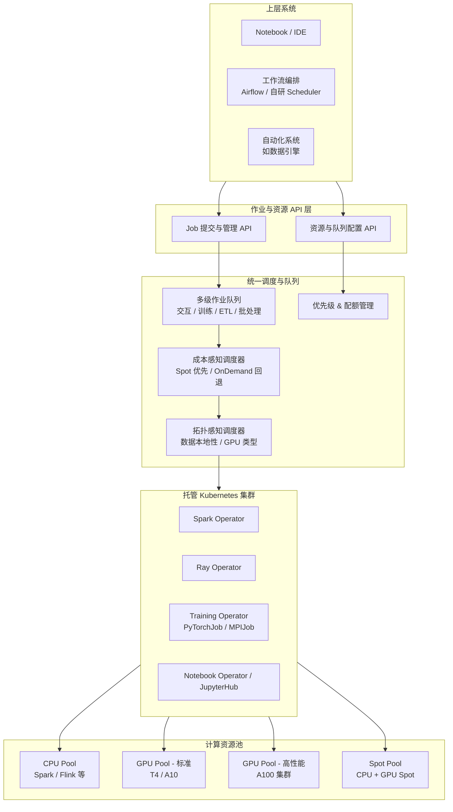

**说明**：
- 所有作业统一通过 `JAPI` 提交，调度逻辑对上层产品（Notebook、工作流）透明。
- `SCHED` 模块负责把“作业意图”翻译成“资源需求”，并结合队列策略、配额策略和成本策略做决策。
- K8s 作为底层资源管理与编排平面，通过各类 Operator 将 Spark、Ray、分布式训练等映射为原生 K8s 工作负载。

### 2.2 工作负载类型与映射

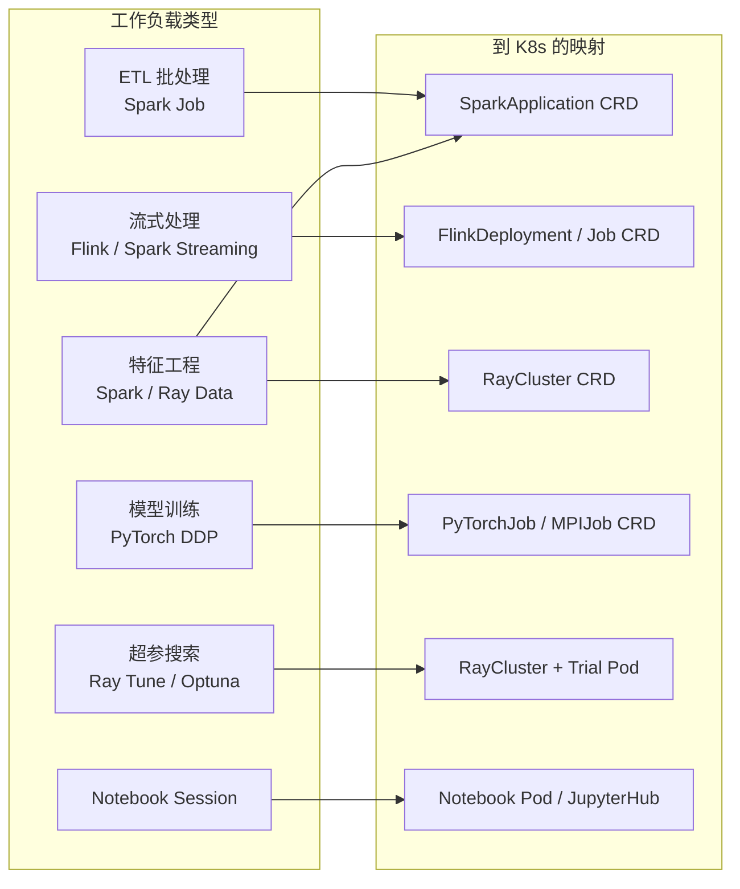

**设计要点**：
- 统一的 CRD（自定义资源）体系使得所有作业都能通过 K8s 原语进行生命周期管理。
- 每类工作负载都有专门的 Operator 管理，调度器只需对“资源请求 + 约束条件”做决策。

---

## 3. 资源池与节点形态设计

### 3.1 多资源池架构

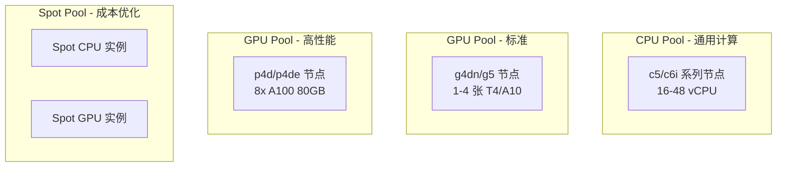

**各资源池职责**：
- **CPU Pool**：ETL、数据清洗、特征工程前处理、统计分析等。
- **GPU 标准 Pool**：中小规模训练、图像/点云预处理、批量推理。
- **GPU 高性能 Pool**：大模型或超大 batch 的分布式训练。
- **Spot Pool**：对中断容忍的作业（如可重启 ETL、带 checkpoint 的长训）优先使用。

### 3.2 资源池与作业类型的绑定策略

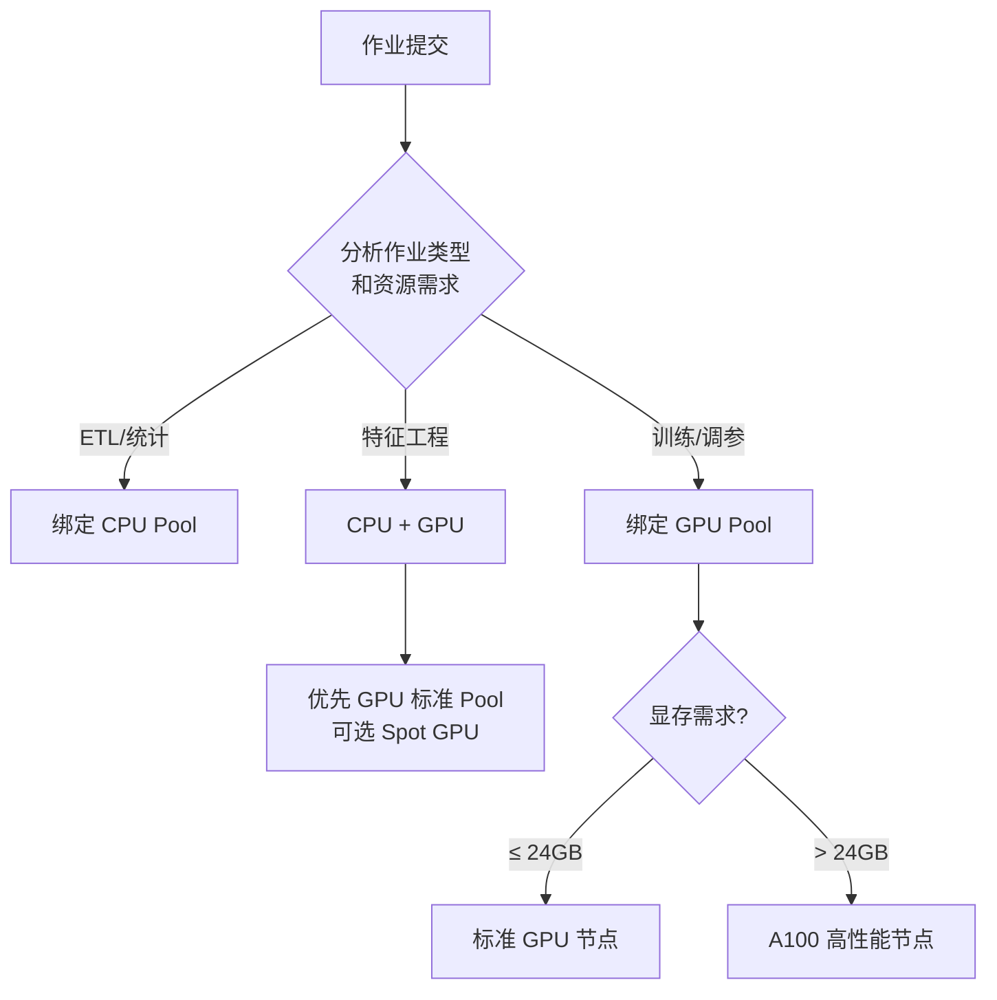

**策略要点**：
- 以 **作业类型 + 显存估算结果** 为主，自动给出资源池推荐，用户可在 UI 中少量覆盖。
- 对轻量训练或调参任务优先使用标准 GPU / Spot GPU，重训或核心模型才上 A100。

---

## 4. 作业队列与统一调度

### 4.1 多级队列模型

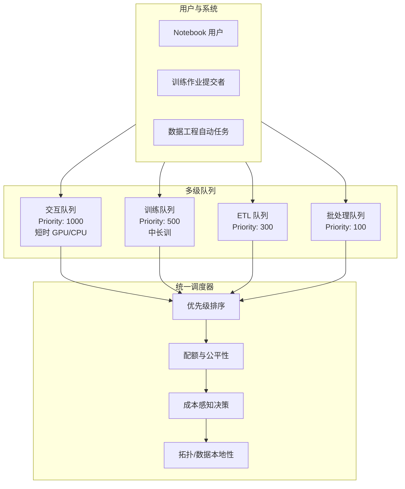

**说明**：
- **交互队列**：确保 Notebook/小实验低延迟，通常不可被抢占，资源上限较小。
- **训练队列**：中高优先级，可抢占低优先级批处理作业。
- **ETL 队列**：以吞吐和成本为主，优先跑在 CPU Pool + Spot。
- **批处理队列**：最低优先，适合夜间/闲时跑的长任务。

### 4.2 提交流程与调度路径

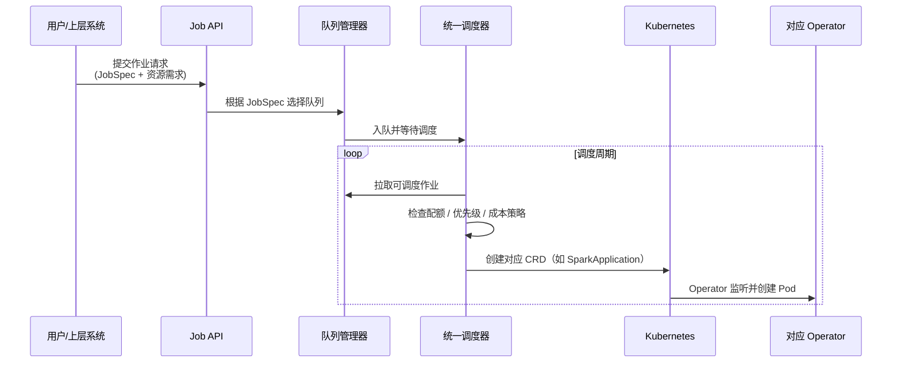

**要点**：
- JobSpec 中包括：作业类型、资源请求、优先级 hint、是否可使用 Spot、是否可被抢占等。
- 队列与调度器之间采用拉取+批调度方式，以降低频繁调度开销。

---

## 5. 调度策略：优先级、配额、成本与拓扑

### 5.1 优先级与抢占

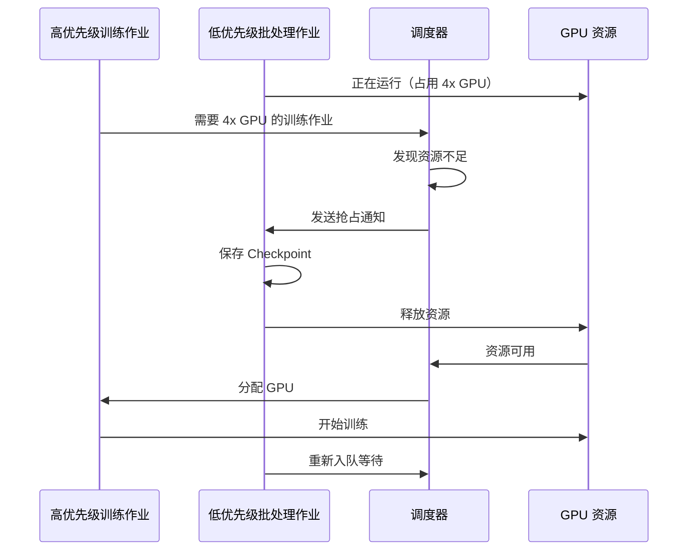

**策略说明**：
- 仅允许抢占 **可容错、允许中断** 的低优先级作业（配置级区分）。
- 抢占前调度器会检查作业的最近 Checkpoint 时间和剩余预算，避免频繁中断浪费成本。

### 5.2 分层配额管理

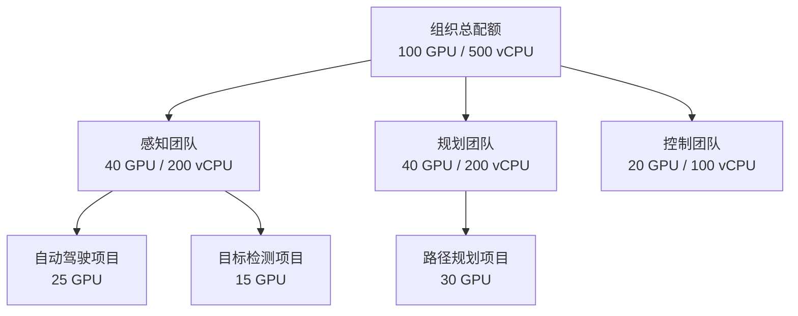

**配额要点**：
- 支持 **组织 → 团队 → 项目 → 用户** 的多层配额，下层配额不可突破上层硬上限。
- 引入 **软配额/借用机制**：未使用配额可被其他团队暂用，但在突发需求时可被回收。

### 5.3 成本感知调度

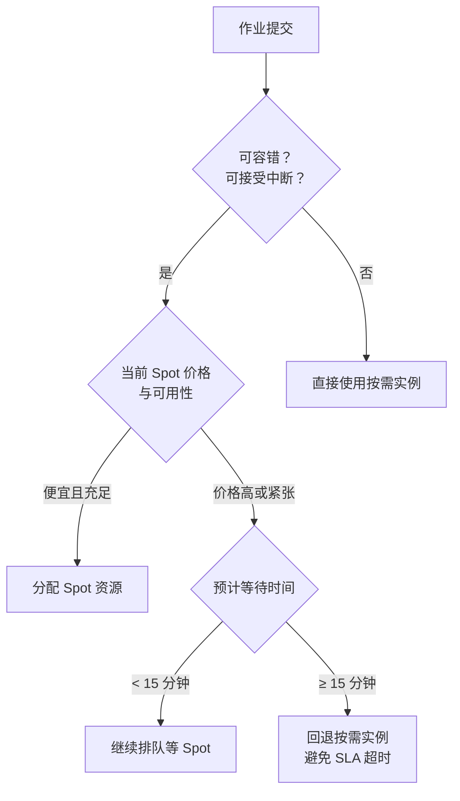

**策略说明**：
- 为每类作业配置 **成本上限/预算区间**，调度时综合考虑单小时成本和总时长。
- 对 **探索性训练** 强调成本最优，对 **关键生产训练** 强调时效和可靠性。

### 5.4 拓扑感知与数据本地性

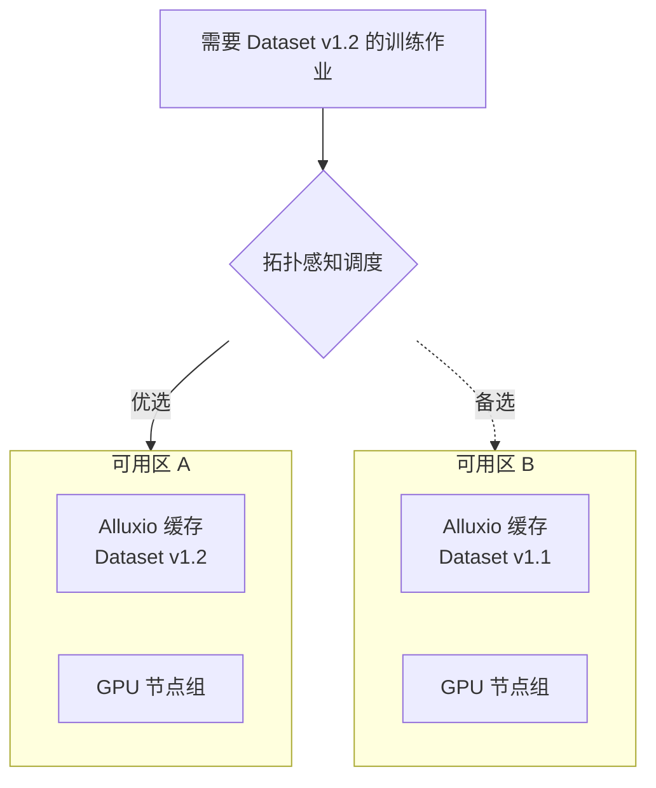

**设计要点**：
- 元数据中记录每个数据集版本在各可用区本地缓存命中情况及容量。
- 调度器优先将作业派发到 **数据就近、有缓存** 的节点组，减少跨区访问 S3 的成本与延迟。

### 5.5 调度算法设计细节

本节在前面策略描述的基础上，从算法视角给出更细粒度的调度逻辑说明，方便后续实现与优化。

#### 5.5.1 调度周期与多阶段决策

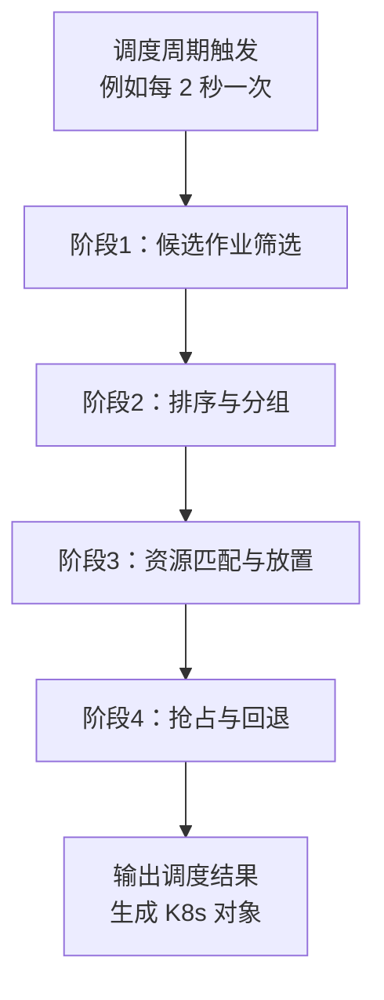

- **阶段 1：候选作业筛选**  
  - 过滤掉：已被取消、已超时、Quota 不足、预算耗尽等作业。  
  - 基于队列优先级和限速策略选择每轮可参与排序的候选集合（例如最多 100 个）。

- **阶段 2：排序与分组**  
  - 使用综合评分函数 `Score(job)` 排序：  
    \[
    Score = w_p \cdot Priority + w_w \cdot f(\text{等待时间}) + w_f \cdot FairSharePenalty
    \]
    - `Priority`：队列/作业的基础优先级。  
    - `等待时间`：等待越久，得分越高，避免“饿死”。  
    - `FairSharePenalty`：已过度使用资源的团队/项目会被打分惩罚。  
  - 对需要 **Gang Scheduling** 的作业（如分布式训练）进行分组，保证同一组要么整体成功调度，要么整体不调度。

- **阶段 3：资源匹配与放置**  
  - 对每个候选作业，按照以下顺序尝试放置：
    1. **首选资源池匹配**：根据作业类型与显存需求，选择目标资源池（如标准 GPU Pool）。  
    2. **节点过滤**：只保留满足以下条件的节点：  
       - 有足够的 CPU/GPU/内存余量。  
       - Label/污点/容忍度（如 GPU 类型、可用区、机架）满足约束。  
       - 配额和成本预算允许。  
    3. **放置算法**：采用 **分数打分 + Bin Packing** 组合策略：  
       - 评分维度：节点当前负载、数据本地性、预估网络成本等。  
       - 目标：在确保数据本地性的前提下尽量把负载“打包”，避免大量小作业分散导致碎片。

- **阶段 4：抢占与回退**  
  - 若高优先级作业无法找到可用资源，则调用抢占逻辑：
    - 按“优先级从低到高 + 剩余运行时间从长到短”选择被抢占候选。  
    - 对支持 Checkpoint 的作业先发送 Checkpoint 信号，待确认后再回收资源。  
  - 若仍无法满足需求（例如没有可抢占目标或预算不足），则作业保持排队状态，并记录调度失败原因用于观测。

#### 5.5.2 公平共享（Fair Share）与配额结合

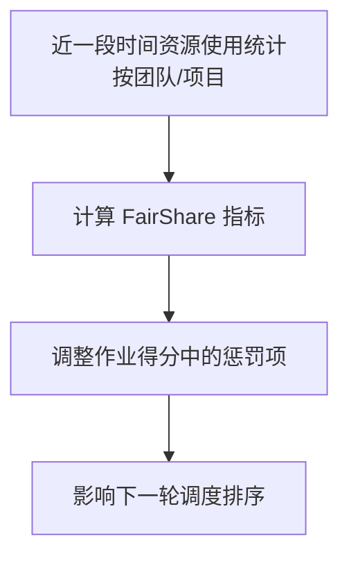

- 对每个团队/项目，维护滚动时间窗口内的 **GPU 小时 / CPU 小时** 使用统计。  
- 定义期望份额 `ExpectedShare`（由配额决定）与实际份额 `ActualShare`：  
  - 若某团队 `ActualShare >> ExpectedShare`，则对其新作业增加惩罚项。  
  - 若某团队长期低于期望，则在排序中给予适度倾斜（鼓励“补偿使用”）。  
- 这样在 **配额硬上限** 之上，再叠加一层 **软公平性** 控制，避免“抢占配额”导致体验极差。

#### 5.5.3 Gang Scheduling（成组调度）

分布式训练等作业需要多 GPU 节点同时到位，否则无法启动，故采用成组调度：

- 在调度阶段为 Gang 作业预分配“资源申请集合”，只有当集合中所有 Pod 都找到合适节点时才真正下发到 K8s。  
- 若只部分 Pod 找到位置，则全部撤销，等待下一轮调度，避免半启动状态浪费资源。  
- 对大 Gang 作业（如 16 节点 128 GPU）引入：
  - **优先预占窗口**：允许在一小段时间内“积累”足够空闲资源再统一调度。  
  - **最大等待时长**：超过则提示用户缩小规模或调整资源池。

#### 5.5.4 Backfill（回填）策略

为避免因为等待大作业导致整体资源空转，引入回填策略：

- 调度器首先为高优先级、大 Job 预估未来一段时间内的资源需求。  
- 对暂时无法满足的大 Job，“标记保留窗口”。  
- 在保留窗口内，如果仍有短时空闲资源，可以调度 **短作业或低优先任务** 填档，但必须确保：  
  - 其预计运行时间不影响高优任务在保留窗口内启动。  
  - 或该短作业可被抢占且有 Checkpoint 支持。

#### 5.5.5 成本感知的具体打分方式

在资源放置时，引入简单的成本打分模型：

\[
NodeScore = w_l \cdot LocalityScore - w_c \cdot CostPerHour - w_f \cdot Fragmentation
\]

- `LocalityScore`：数据本地性评分，高缓存命中优先。  
- `CostPerHour`：按 GPU/CPU 实例单价换算的小时成本；Spot 实例成本较低但要结合中断风险。  
- `Fragmentation`：若在该节点放置后容易造成资源碎片，则增加惩罚。  

调度器通过调整权重 `w_l, w_c, w_f`，在 **性能优先** 与 **成本优先** 模式之间灵活切换。

---

## 6. 弹性伸缩与容量管理

### 6.1 自动扩缩容状态机

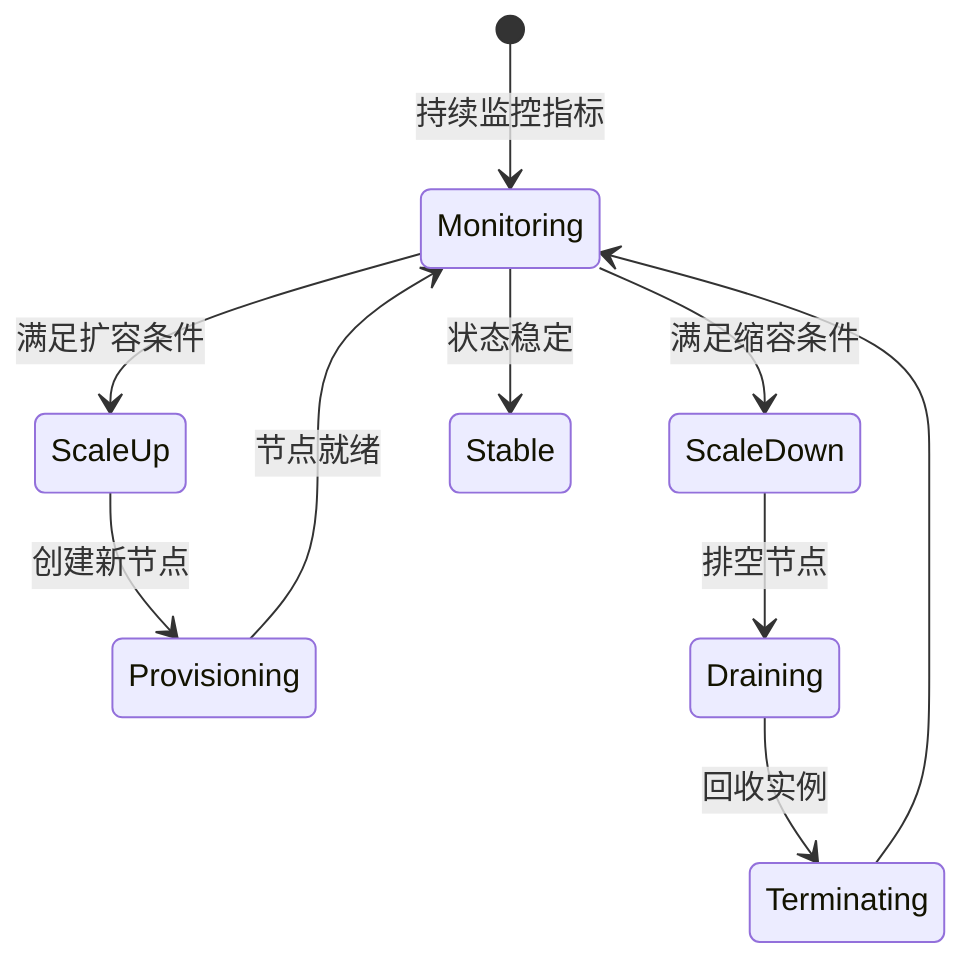

**扩容触发信号（示例）**：
- 队列等待时间（训练队列 P95 > 5 分钟）。
- GPU 利用率长时间 > 85%。  
- Pending Pod 数量连续多个周期 > 阈值。  

**缩容触发信号（示例）**：
- 空闲 GPU/CPU 节点持续空闲 > 15 分钟。  
- 当前队列无排队作业。  

### 6.2 各资源池扩缩容差异策略

| 资源池           | 扩容触发         | 扩容速度 | 缩容策略               | 最小/最大节点数  |
|------------------|------------------|----------|------------------------|------------------|
| CPU Pool         | ETL 队列等待 >3m | 快       | 空闲 10m 即缩容        | 10 / 100         |
| GPU 标准 Pool    | 训练等待 >5m     | 中       | 空闲 15m 后渐进缩容    | 5 / 50           |
| GPU 高性能 Pool  | 审批后手动扩容   | 慢/人工  | 空闲 30m 后缩容        | 0 / 10           |
| Spot Pool        | 队列等待 >2m     | 快       | 空闲 5m 即缩容         | 0 / 200          |

**设计考虑**：
- 标准 GPU Pool 强调平衡训练体验与成本，避免频繁扩缩容导致训练启动极慢。
- 高性能 GPU Pool 价格昂贵，采用 **半自动 + 人工审批** 的模式防止滥用。

---

## 7. 可观测性与运维闭环

### 7.1 指标与日志采集

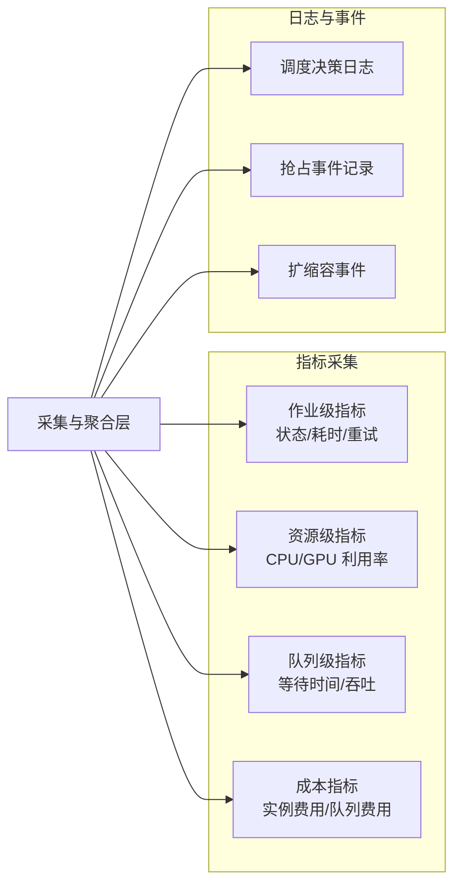

**用途**：
- 为平台运营方提供队列公平性、抢占频率、资源利用率的量化视图。
- 支持 **回放调度决策**，定位异常调度行为或成本异常。

### 7.2 调度与容量的优化闭环

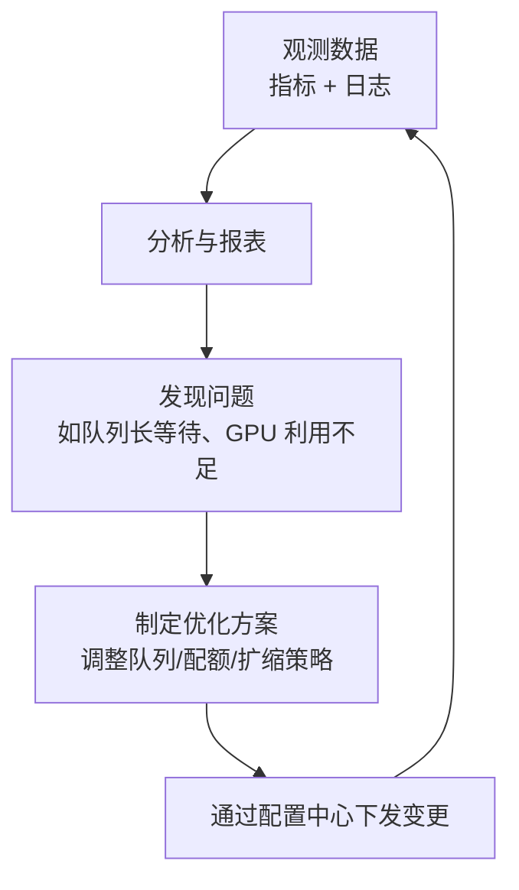

**示例优化场景**：
- 发现训练队列经常长时间排队 → 提高 GPU Pool 最小节点数或增加 Spot 使用比例。
- 发现某团队长期占用大量 GPU 但平均利用率低 → 通过配额与成本告警促使其优化作业。

---

## 8. 与其它层的协同与边界

- **与数据湖（L2）/元数据层（L3）**：
  - 调度器通过元数据感知数据存放位置、缓存情况，从而进行拓扑感知调度。
  - 作业生命周期与数据血缘打通，可追踪“某训练作业使用了哪些数据版本与特征版本”。

- **与模型训练与服务层（L5）**：
  - 训练 Job 的资源申请、调度、Checkpoints 管理由本层负责。
  - 训练完成的模型交由 L5 进行版本注册与上线发布，本层仅关心训练阶段资源使用。

- **与用户与工具层（L7）**：
  - Notebook / Job UI / API 只与 Job API 交互，不直接操作底层资源。
  - UI 侧展示队列状态、预估开始时间、预计费用等信息，增强用户对调度行为的理解。

---

## 9. 小结：计算与调度层的价值

- **统一算力平面**：将分散的 CPU/GPU/Spot 资源统一成一个可被编排和观测的资源平面。
- **多队列 + 多资源池**：通过队列、优先级、配额、成本策略实现对不同作业类型的差异化服务。
- **智能调度与弹性能力**：结合拓扑感知、成本感知和自动扩缩容，使得平台既能保证性能，又能显著降低成本。
- **可观测与可治理**：通过监控、日志和配额治理，为平台长期稳定运营和持续优化提供基础。

该层作为整个机器人训练数据处理平台的“算力中枢”，确保上层数据处理与训练工作负载在公有云环境中高效、可控、可持续地运行。

---

## 10. 技术栈与第三方组件选型建议

本节聚焦于实现计算与调度层时可选用的关键三方组件与库，重点考虑 **成熟度、生态、云环境适配度**。

### 10.1 调度与批作业框架

- **Kubernetes 原生调度扩展**：
  - **Kueue**：K8s 官方 SIG-scheduling 下的批作业队列与配额管理框架，适合训练/ETL 队列场景。  
  - **Volcano / Yunikorn**：适合大规模批作业与 GPU 调度，支持队列、Gang Scheduling、抢占等高级特性。
  - 适用场景：  
    - 对 K8s 依赖重、期望统一资源平面的场景。  
    - 希望尽量复用社区已有的调度能力，减少自研工作量。

- **作业级编排**：
  - **Apache Airflow**：成熟的工作流引擎，用于“数据接入 → ETL → 特征工程 → 训练 → 评估”的 DAG 编排。  
  - **Prefect / Argo Workflows**：更云原生的选择，与 K8s 结合紧密，适合全容器化场景。

### 10.2 分布式计算与训练框架

- **Spark**：
  - 用于大规模 ETL、批量特征工程，配合 **Spark on Kubernetes** + **Spark Operator** 使用。  
  - 优势：生态成熟、对 Parquet/Delta 等数据湖格式支持好。

- **Flink / Spark Streaming**：
  - 用于实时数据接入与流式处理，构建实时特征与在线指标。  
  - 若实时性要求极高且复杂流计算，Flink 更合适；若希望与现有 Spark 生态复用，可优先 Spark Streaming。

- **Ray / Ray Data / Ray Tune**：
  - 用于分布式 Python 任务、特征工程与超参搜索。  
  - 与 Ray Operator 配合，可在 K8s 上动态创建 Ray 集群。

- **PyTorch / PyTorch Lightning / DeepSpeed**：
  - 核心训练框架，支持 DDP、模型并行与混合并行。  
  - **PyTorch Lightning** 简化训练逻辑，提升可维护性；**DeepSpeed** 适合大模型训练。

### 10.3 K8s Operator 与 CRD 选型

- **Spark Operator（Google / community）**：
  - 通过 `SparkApplication` CRD 管理 Spark 作业生命周期。  
  - 支持动态资源申请、失败重试、日志采集等。

- **Kubeflow Training Operator**：
  - 提供 `PyTorchJob`、`TFJob`、`MPIJob` 等 CRD，适合统一管理多框架训练。  
  - 与 Kueue、Volcano 等组合，可实现 Gang Scheduling 与队列调度。

- **Ray Operator**：
  - 通过 `RayCluster` CRD 管理 Ray 集群，自动扩缩。  
  - 适合特征工程、在线服务与超参搜索等。

- **JupyterHub / Kubeflow Notebook Controller**：
  - 为 Notebook 场景提供多用户会话管理与资源隔离，结合本方案的交互队列使用。

### 10.4 成本与监控相关组件

- **Prometheus + Grafana**：
  - 采集 K8s、节点、GPU、作业指标，并展示在统一 Dashboard 上。  
  - 可通过自定义 Exporter 采集队列延迟、调度事件、成本估算等。

- **Thanos / Cortex**：
  - 用于大规模时序指标的长周期存储，便于做长期成本与容量分析。

- **OpenTelemetry + Jaeger**：
  - 实现从 Job API → 调度器 → K8s → 训练容器的全链路追踪，辅助定位调度与性能问题。

### 10.5 数据本地性与缓存层组件

- **Alluxio / JuiceFS / Nydus 等分布式缓存层**：
  - Alluxio：成熟的数据加速层，可将 S3 上的训练数据缓存到本地 SSD 或内存。  
  - JuiceFS：兼具文件系统接口与对象存储后端，适合训练数据与 Checkpoint 存取。  
  - 这些组件与拓扑感知调度器结合，可显著降低跨区/跨机架的数据访问成本。

### 10.6 技术选型建议小结

- **调度核心**：优先基于 **Kubernetes + Kueue/Volcano/Yunikorn**，只在必要逻辑上做“插件式扩展”（如成本打分、Fair Share）。  
- **计算引擎**：ETL/特征工程用 Spark/Flink，训练用 PyTorch + Training Operator，超参与分布式 Python 用 Ray。  
- **编排与体验**：上层采用 Airflow/Argo 进行工作流编排，Notebook 采用 JupyterHub 或类 Databricks Notebook 服务。  
- **缓存与本地性**：Alluxio/分布式缓存 + 拓扑感知调度组合，实现“就近计算”。  

整体技术栈在保持开源、云中立的前提下，尽量选择社区成熟组件，并通过统一的调度与 CRD 体系将其整合在一起，减少自研调度器的工作量，把精力投入到 **策略与算法层的差异化能力** 上。

